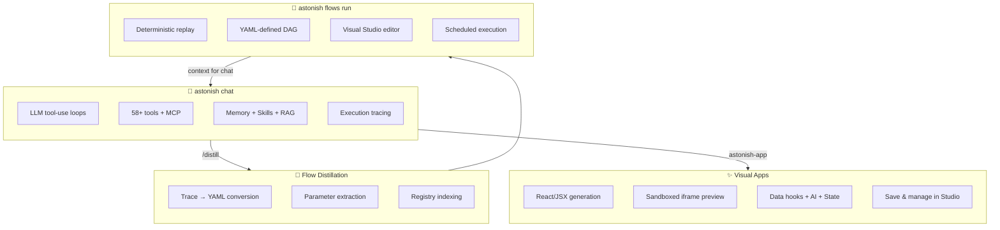

<div align="center">


# Astonish

### An autonomous AI agent that learns your workflows

*Chat-first. Single binary. Zero infrastructure. Built in Go.*

[](https://schardosin.github.io/astonish/)
[](https://github.com/schardosin/astonish/actions/workflows/lint.yml)
[](https://github.com/schardosin/astonish/actions/workflows/build.yml)
[](LICENSE)
[](https://goreportcard.com/report/github.com/schardosin/astonish)

</div>

---

Astonish is an autonomous AI agent you run locally. It solves problems dynamically using LLM-driven tool-use loops (shell commands, file edits, web fetches, browser automation, email, memory recall) and adapts to whatever the task demands. When a task is complex enough, Astonish can distill the successful execution into a reusable YAML flow. The agent gets smarter as you use it.

Inspired by [OpenClaw](https://github.com/openclaw/openclaw)'s vision of personal AI assistants (always-on daemons, skills-as-markdown, multi-channel messaging) and by [Perplexity Computer](https://www.perplexity.ai/hub/blog/perplexity-computer)'s demonstration that sub-agent delegation, plan tracking, and transparent execution are the future of AI agents, Astonish takes the best ideas from both and implements them in Go as a single compiled binary. The result: **Perplexity Computer's ambition with OpenClaw's flexibility**, fully open-source and running on your hardware.

---

## 🚀 Quick Start

```bash
# Install (macOS/Linux)
brew install schardosin/astonish/astonish

# Or via curl
curl -fsSL https://raw.githubusercontent.com/schardosin/astonish/refs/heads/main/install.sh | sh

# Configure your AI provider
astonish setup

# Start chatting
astonish chat
```

Astonish itself is a single Go binary with no runtime dependencies. MCP servers you add may use `npx`, `uvx`, or `docker` depending on the server, but the core agent needs nothing else installed.

---

## 💬 Autonomous Chat Agent

The core of Astonish is a dynamic agent that uses LLM-driven tool-use loops to solve problems. It decides which tools to call, chains them together, and works through multi-step tasks without predefined workflows. Use it from the terminal with `astonish chat`, or talk to it from anywhere through integrated channels like Telegram and Email.

**58+ built-in tools** including shell execution (PTY-backed with background processes), file operations, web fetching with readability extraction, PDF reading, semantic memory search, browser automation, email (read, send, search, wait for verification emails), credential management, sub-agent delegation, and skill lookup.

**MCP native.** Any MCP server works out of the box. Add GitHub, Slack, databases, or any other MCP-compatible tool. Your agent gains capabilities without touching code.

**15+ AI providers.** OpenAI, Anthropic, Google Gemini, Groq, OpenRouter, xAI, Ollama, LM Studio, SAP AI Core, LiteLLM, and more. Swap providers mid-session by editing config and the agent hot-swaps without restart.

```bash
astonish chat                          # Start a new session
astonish chat -p anthropic -m claude-4  # Use a specific provider/model
astonish chat --resume                 # Resume your last session
```

---

## ✨ Visual Apps

The agent can build live, interactive React applications directly in the conversation. Describe what you need and a running app appears in your chat — styled with Tailwind CSS, with charts, icons, data connections, and persistent storage.

```
You:    "Build me a project tracker with task priorities and due dates"
Agent:  Here's a project tracker with persistent storage...
        [Live interactive app appears in chat]

You:    "Add a chart showing tasks completed per week"
Agent:  [App updates with a Recharts bar chart]

You:    "Save it"
Agent:  Saved as "project_tracker" — open it anytime from the Apps tab.
```

- **React + Tailwind + Recharts + Lucide.** Full component library with charts and 200+ icons, all running in the browser.
- **Live data** via `useAppData`. Connect to MCP tools, REST APIs (with OAuth credentials), or static config. The agent wires up the data sources for you.
- **In-app AI** via `useAppAI`. One-shot LLM calls for summarization, classification, or analysis — embedded directly in the app.
- **Persistent state** via `useAppState`. Each app gets its own SQLite database that survives page reloads. Build CRUD apps, not just dashboards.
- **Iterative refinement.** Ask for changes and the app updates in place. Save when you're happy.
- **Security sandboxed.** Apps run in an isolated iframe with an opaque origin. No access to parent DOM, cookies, or APIs. Data flows through an SSRF-protected server-side proxy.

Saved apps live in the **Apps** tab in Studio and as YAML files in `~/.config/astonish/apps/`.

---

## 🔄 Flow Distillation

This is what makes Astonish different. The agent doesn't just solve problems, it learns from how it solved them.

**Phase 1: Solve freely.** The agent works through your request dynamically, calling whatever tools it needs. The entire execution is traced.

**Phase 2: Distill.** After a successful multi-step task, run `/distill`. The agent analyzes its execution trace and generates a reusable YAML flow, parameterized, validated, and ready to use.

**Phase 3: Reuse.** The distilled flow becomes a first-class artifact. In chat, the agent recognizes similar requests and uses the saved flow as a guide for its execution. But the real value is beyond chat: you can view and edit the flow visually in Astonish Studio, use the AI Assistant to refine it, schedule it as a recurring job through the daemon, or share it with your team as a version-controlled YAML file.

```
You:    "Check how much memory my proxmox server has"
Agent:  [shell_command] ssh root@192.168.1.100 free -h
        Your server has 64GB total, 42GB used, 22GB free.

You:    /distill
Agent:  I'll distill this into a reusable flow...
        Saved: check_proxmox_memory.yaml
        Run again: astonish flows run check_proxmox_memory -p host="192.168.1.100"

# Now you can:
# - Schedule it:  astonish scheduler add --cron "0 9 * * *" --flow check_proxmox_memory
# - Edit visually: open it in Astonish Studio and refine with the AI Assistant
# - Share it:      commit the YAML to your team's repo
# - Chat reuse:    next time you ask "check proxmox memory", the agent uses the saved flow as context
```

Distilled flows are plain YAML files. Version control them. Review them in PRs. Share them with your team.

---

## 🧠 Semantic Memory & RAG

Astonish maintains a persistent memory system powered by vector search with local embeddings. No external API calls for embeddings, everything runs on your machine.

- **Automatic knowledge retrieval.** Before every LLM call, a semantic search runs against your indexed knowledge. Relevant context is injected automatically, no manual prompt engineering needed.
- **Two-tier memory.** Core facts in `MEMORY.md` (the agent remembers things you tell it) plus a knowledge tier for longer documents, project notes, and skill content.
- **SELF.md.** The agent maintains a self-portrait: which provider it's using, what tools are available, what flows are saved, what skills are loaded. It knows what it can do.
- **INSTRUCTIONS.md.** Behavioral guidelines the agent follows. Editable by you, never overwritten by the system.

```bash
astonish memory search "kubernetes deployment patterns"
astonish memory list
astonish memory reindex
```

---

## 📚 Skills System

Skills teach the agent how to use CLI tools, APIs, and workflows without needing formal tool integrations. A skill is just a markdown file with YAML frontmatter.

**Two-tier retrieval.** A lightweight index of all skill names and descriptions is always in the system prompt (~500 chars). Full skill content is retrieved on-demand, either automatically via vector search when your query matches, or explicitly when the agent calls `skill_lookup` by name.

**9 bundled skills** ship with the binary: `github`, `docker`, `git`, `npm`, `python`, `kubernetes`, `terraform`, `aws`, `gcloud`. Each skill is only activated when its required binaries are present on your system.

**Community skills via ClawHub.** Install community-authored skills from the [ClawHub](https://clawhub.com) registry:

```bash
astonish skills install owner/docker-compose-advanced
astonish skills install https://clawhub.com/owner/kubernetes-helm
astonish skills list
astonish skills create my-custom-tool    # Create from template
```

**Live reload.** Add, edit, or remove skill files at any time. A file watcher detects changes and re-syncs to the vector store automatically, no restart needed.

Drop a `SKILL.md` in `~/.config/astonish/skills/my-tool/` and the agent knows how to use it.

---

## 🌐 Native Browser Automation

32 browser tools implemented in pure Go via [rod](https://github.com/go-rod/rod) and the Chrome DevTools Protocol. No Node.js. No Playwright. No npm. Zero external dependencies.

| Category | Capabilities |
|----------|-------------|
| **Navigation** | Go to URLs, go back, wait for elements |
| **Interaction** | Click, type, hover, drag, press keys, select options, fill forms |
| **Observation** | Accessibility tree snapshots, screenshots, console messages, network requests |
| **State** | Cookies, localStorage, sessionStorage, response body interception |
| **Emulation** | 36 device presets, geolocation, timezone, locale, media features, offline mode |
| **Stealth** | Anti-detection (User-Agent, Client Hints, webdriver patching, automation flags) |
| **Screenshots** | Auto-compression for LLM context efficiency (resize + progressive JPEG quality) |

The browser launches lazily on first use with a persistent profile at `~/.config/astonish/browser/`.

---

## 🕐 Always-On Daemon & Scheduler

Run Astonish as a system service that stays alive across reboots.

```bash
astonish daemon install    # Install as launchd (macOS) or systemd (Linux) service
astonish daemon start
astonish daemon status
```

**Cron scheduler** with two execution modes:
- **Routine**: headless replay of saved flows on a schedule
- **Adaptive**: the agent interprets a natural language instruction each time it runs

```bash
# The agent can schedule its own jobs during conversation:
You:    "Remind me every morning at 9am to check my server health"
Agent:  [schedule_job] Created job "server_health_check" with cron "0 9 * * *"
```

**Channel integrations.** Connect Telegram or Email and interact with your agent from anywhere. Results from scheduled jobs are broadcast to connected channels.

```bash
astonish channels setup telegram    # Interactive setup with token validation
astonish channels setup email       # IMAP/SMTP setup with connection test
```

**Email as a tool.** Beyond the inbound channel, the agent has 8 email tools (list, read, search, send, reply, mark read, delete, wait) that work independently. The agent can receive verification emails during autonomous web registration flows, even if the inbound email channel is disabled. Just configure IMAP/SMTP credentials and the tools are available.

---

## 🤖 Sub-Agent Delegation

For complex tasks that benefit from parallel execution, the agent can delegate work to sub-agents running in isolated sessions.

```
You:    "Review the authentication module and the payment module for security issues"
Agent:  I'll delegate these as parallel tasks...
        [delegate_tasks]
          Task 1: "Review auth module for security issues" → sub-agent-1
          Task 2: "Review payment module for security issues" → sub-agent-2
        Both completed. Here's a combined report...
```

- Up to 10 parallel sub-agents with configurable concurrency
- Isolated sessions with filtered tool access (sub-agents can't schedule jobs or save credentials)
- Execution traces from sub-agents are flattened back into the parent's trace for distillation
- Configurable depth limits prevent infinite delegation chains

---

## 📊 Transparent Execution

Inspired by Perplexity Computer's approach to execution visibility, Astonish Studio now provides real-time insight into what the agent is doing, how much it costs, and where it is in the plan.

**Plan auto-progression.** When the agent announces a multi-step plan, each step automatically transitions from pending to running to complete as the agent works. No manual `update_plan` calls needed. Delegation starts and tool execution triggers advance the plan in real-time. The Studio toolbar shows the current phase at a glance.

**Token usage tracking.** Every LLM call reports actual input/output tokens from the provider API (OpenAI, Anthropic, Google, Bedrock). No heuristic estimates. The Studio toolbar shows cumulative token usage in a popover, and usage persists across browser refreshes by deriving totals from the session transcript.

**Email with PDF attachments.** When the agent delivers reports via email, markdown artifacts are converted to PDF through a headless Chrome pipeline and attached to the message. The same reports that appear in Studio are delivered as professional documents to any inbox.

**Token optimization.** Sub-agent results under 20,000 characters are inlined directly into the orchestrator's context instead of requiring an extra round-trip. Combined with plan simplification, this reduces total token consumption by over 40% compared to naive delegation.

---

## 🔐 Encrypted Credentials

Secrets are encrypted at rest with AES-256-GCM and protected by a five-layer defense:

1. **Encryption at rest**: credentials stored in `credentials.enc`, key in `.store_key`
2. **File-path blocking**: `read_file`, `write_file`, `shell_command` cannot access credential files
3. **Tool output redaction**: secrets are scrubbed from tool results before the LLM sees them
4. **LLM response redaction**: if the LLM echoes a secret in its response, it's caught at the yield point
5. **Key signature tracking**: raw, base64, and URL-encoded forms of each secret are tracked

```bash
astonish credential add       # Interactive form (type, name, value)
astonish credential list      # Show stored credentials (values hidden)
astonish credential test      # Verify credentials work
```

The agent can also manage credentials during conversation via LLM tools, and config.yaml API keys are automatically migrated to the encrypted store on first run.

---

## 🎨 Visual Flow Designer

Astonish Studio lets you design agent flows visually and run the exact same YAML from the command line. No export step, no format conversion.

```bash
astonish studio              # Opens at http://localhost:9393
```

- **AI Assistant**: describe what you want, let AI generate the flow
- **Drag-and-drop** designer with real-time execution output
- **MCP native**: first-class support for any MCP server
- **Flow Store**: install community flows with Homebrew-style taps
- **GitOps ready**: everything saves directly to YAML

```bash
# Community flows
astonish tap add schardosin/astonish-flows
astonish flows store install technical_article_generator
astonish flows run technical_article_generator
```

---

## 🤖 Supported AI Providers

| Provider | Type | Notes |
|----------|------|-------|
| **OpenRouter** | Cloud | 100+ models with one API key |
| **OpenAI** | Cloud | GPT-4o, o1, o3 |
| **Anthropic** | Cloud | Claude Opus, Sonnet, Haiku |
| **Google Gemini** | Cloud | Gemini Pro, Flash |
| **Groq** | Cloud | Ultra-fast inference |
| **xAI** | Cloud | Grok models |
| **LiteLLM** | Cloud/Local | Unified interface for 100+ providers |
| **Ollama** | Local | Self-hosted open models |
| **LM Studio** | Local | Self-hosted with GUI |
| **SAP AI Core** | Cloud | SAP enterprise AI |

Configure via `astonish setup` (CLI wizard) or Astonish Studio (Settings > Providers).

---

## 🏗️ Architecture

Built on [Google's Agent Development Kit (ADK)](https://github.com/google/adk-go) with dual execution modes connected by flow distillation:


```mermaid
flowchart TB
    subgraph Chat["💬 astonish chat"]
        direction TB
        C1["LLM tool-use loops"]
        C2["58+ tools + MCP"]
        C3["Memory + Skills + RAG"]
        C4["Execution tracing"]
    end

    subgraph Distill["🔄 Flow Distillation"]
        direction TB
        D1["Trace → YAML conversion"]
        D2["Parameter extraction"]
        D3["Registry indexing"]
    end

    subgraph Flows["📄 astonish flows run"]
        direction TB
        F1["Deterministic replay"]
        F2["YAML-defined DAG"]
        F3["Visual Studio editor"]
        F4["Scheduled execution"]
    end

    subgraph Apps["✨ Visual Apps"]
        direction TB
        A1["React/JSX generation"]
        A2["Sandboxed iframe preview"]
        A3["Data hooks + AI + State"]
        A4["Save & manage in Studio"]
    end

    Chat -->|/distill| Distill
    Distill --> Flows
    Flows -->|"context for chat"| Chat
    Chat -->|"astonish-app"| Apps
```

The agent starts dynamic. As workflows accumulate, common tasks gain structure that you can inspect, edit, schedule, and share.

---

## 🦞 Standing on Shoulders: OpenClaw

Astonish owes a significant debt to [OpenClaw](https://github.com/openclaw/openclaw). Studying OpenClaw's architecture (its skills-as-markdown system, always-on daemon with channel integration, tool-use-first agent loops, and the overall vision of a personal AI assistant that lives on your machine) directly shaped how Astonish was built.

**What we learned from OpenClaw:**
- Skills don't need to be formal tool integrations. A markdown file that teaches the agent how to use `gh` or `kubectl` is enough.
- An always-on daemon with channel delivery turns an agent from a CLI toy into something genuinely useful.
- The agent loop should be unconstrained during problem-solving. Structure comes after, not before.

**What Astonish adds:**
- **Flow distillation.** Successful agent interactions crystallize into reusable, auditable YAML workflows. The system accumulates knowledge over time.
- **Go-native.** Single compiled binary with no runtime dependencies. Runs on anything from a Raspberry Pi to a CI/CD pipeline.
- **Dual-mode execution.** Dynamic chat and structured flows share the same tool system, provider layer, and session infrastructure.

---

## 🖥️ Standing on Shoulders: Perplexity Computer

[Perplexity Computer](https://www.perplexity.ai/hub/blog/perplexity-computer) proved that the next generation of AI agents needs automatic sub-agent creation, plan tracking with transparent execution, and the ability to run asynchronously for hours on complex tasks. Astonish draws on several of these ideas and makes them available as open-source software you control.

**What we learned from Perplexity Computer:**
- A plan-first execution model with visible step progression gives users confidence in what the agent is doing and why.
- Sub-agent delegation with isolated contexts is the right pattern for parallel research and analysis tasks.
- Token usage transparency matters. Users should see exactly what they're spending, not estimates.

**What Astonish offers that Perplexity Computer doesn't:**
- **Open-source and self-hosted.** Your data never leaves your machine. No subscription required.
- **Flow distillation.** Perplexity Computer has no equivalent. Successful agent runs crystallize into reusable YAML workflows you can version-control, schedule, and share.
- **Multi-channel delivery.** Results aren't trapped in a web UI. The agent delivers reports with PDF attachments via Telegram, Email, or any connected channel.
- **Full tool ecosystem.** 58+ built-in tools, MCP server support, browser automation, encrypted credentials, semantic memory. You own the entire stack.

---

## 🎯 Use Cases

- **DevOps & Infrastructure.** SSH into servers, check health, deploy containers, manage Kubernetes clusters. The agent learns your runbooks and distills them into repeatable flows.
- **Dashboards & Internal Tools.** Describe what you need and get a live React app with charts, data connections, and persistent state. Build admin panels, monitoring dashboards, data explorers, or any interactive tool — no frontend setup required.
- **Code Review & Development.** Navigate codebases, run tests, review PRs, refactor code. Sub-agents can parallelize across multiple files or modules.
- **Research & Web Tasks.** Fetch pages, extract content, search the web, automate browser workflows. 32 native browser tools handle login flows, form filling, and data extraction.
- **Scheduled Automation.** Set up cron jobs through conversation. The daemon runs them on schedule and delivers results to your Telegram or Email.
- **Team SOPs.** Distill successful workflows into YAML flows. Version control them. Share them. Anyone on the team runs them with `astonish flows run`.

---

## 🤝 Contributing & Support

Built with care by an engineer who studied what worked, took the best ideas, and built something new on top.

- [Full Documentation](https://schardosin.github.io/astonish/)
- [Submit a Pull Request](https://github.com/schardosin/astonish/pulls)
- **License**: AGPL-3.0

<div align="center">
<b><a href="https://github.com/schardosin/astonish">Star us on GitHub</a></b>
</div>
