<div align="center">


# Astonish

### Build Production AI Agents in Minutes, Not Months

*Design visually. Run anywhere. No servers required.*

[](https://schardosin.github.io/astonish/)
[](https://github.com/schardosin/astonish/actions/workflows/lint.yml)
[](https://github.com/schardosin/astonish/actions/workflows/build.yml)
[](LICENSE)
[](https://goreportcard.com/report/github.com/schardosin/astonish)

</div>

---

## 💡 Our Vision

**AI SOPs should be designed, not coded.**

We believe the future of AI automation is declarative. You should focus on *what* your agent does, the business logic, the steps, and the outcomes, not *how* to wire up providers, handle errors, or manage retries. Astonish is built for **SOP-driven AI agents** that are structured, reliable, and repeatable.

| You Focus On | Astonish Handles | 
| ----- | ----- | 
| Designing the business flow | Provider connections & authentication | 
| Choosing which tools to use | Error detection & intelligent retries | 
| Defining success criteria | State management (Blackboard pattern) | 
| Business logic | Parallel execution & performance | 

**MCP servers extend capabilities.** Need GitHub integration? Database access? Search the Internet? Add an MCP server. Your flow stays clean, and capabilities plug in via the Model Context Protocol.

**AI assists your design.** Not sure how to structure your flow? Describe what you want in plain English. The AI Assistant generates the flow, refines nodes, and optimizes sequences.

## What Makes Astonish Different

### 🎯 Single Binary, Zero Infrastructure

No web servers. No Docker-compose hell. No cloud subscriptions. Astonish is a single **Go-compiled executable** that runs anywhere, including your laptop, a Raspberry Pi, or a CI/CD pipeline.

```bash
# Add it to your cron
0 9 * * * /usr/local/bin/astonish flows run daily_report >> /var/log/report.log

# Run in any script
./astonish flows run code_reviewer -p repo="./my-project"
```

### 📄 YAML as Source of Truth

Your agent logic lives in simple YAML files. Version control them. Review them in PRs. Move them between environments. No platform lock-in.

```yaml
# This IS your agent. Copy it, share it, version it.
nodes:
  - name: analyze
    type: llm
    prompt: "Analyze {input}"
flow:
  - from: START
    to: analyze
```

### 🖥️ Design Visually, Run Anywhere

Use **Astonish Studio** to design flows visually, then run the exact same YAML from the command line. There is no "export" step and no format conversion.

## ✨ Astonish Studio

<div align="center">

<p>Design your agent flows visually with the built-in <b>Astonish Studio</b></p>
</div>
  
---  
• 🤖 **AI Assistant**. Describe what you want and let AI generate or refine your entire DAG.  
• 🎨 **Visual Designer**. Drag-and-drop nodes with real-time streaming execution output.  
• 🔧 **MCP Native**. First-class support for any MCP server like GitHub, Slack, or Postgres.  
• 🏪 **Flow Store**. Install community agent flows with Homebrew-style taps.  
• 💾 **GitOps Ready**. Save directly to YAML for instant version control.  

---

## 🚀 Quick Start

### 1. Install

```bash
# macOS/Linux (Homebrew)
brew install schardosin/astonish/astonish

# Or via curl
curl -fsSL [https://raw.githubusercontent.com/schardosin/astonish/refs/heads/main/install.sh](https://raw.githubusercontent.com/schardosin/astonish/refs/heads/main/install.sh) | sh
```

### 2. Launch Studio

```bash
astonish studio
```

Opens a local UI at `http://localhost:9393` to configure providers (Gemini, Claude, GPT, Ollama) and design your first flow.

### 3. Run from CLI

```bash
# Run an agent with injected variables
astonish agents run summarizer -p file_path="./notes.txt"
```

## 🔍 Why Astonish?

| Feature | n8n / Flowise | CrewAI / AutoGen | Astonish | 
| ----- | ----- | ----- | ----- | 
| **Setup** | Server-based (Docker) | Python Library | **Single Binary (Go)** | 
| **Logic** | Webhooks/Triggers | LLM "Roleplay" | **Deterministic SOPs** | 
| **Storage** | Database | Python Scripts | **YAML Files** | 
| **Speed** | Moderate | Slow (Python overhead) | **Fast (Goroutines)** | 

## 🏗️ Architecture

Built on **Google's Agent Development Kit (ADK)**, Astonish handles the heavy lifting of provider configuration and tool orchestration. It uses a **State Blackboard** architecture to ensure clean data flow, where Astonish manages the entire connection lifecycle to AI providers.

```mermaid
flowchart TB
    subgraph Astonish["🚀 ASTONISH"]
        YAML["📄 YAML Flow"]
        Studio["🎨 Studio"]
        CLI["⌨️ CLI Runner"]
        
        YAML --> Engine
        Studio --> Engine
        CLI --> Engine
        
        Engine["⚙️ Engine (Go)
        • State Blackboard
        • Parallel Execution
        • Intelligent Retries
        • Error Recovery"]
        
        subgraph Orchestration["🔧 Google ADK"]
            ADK_Core["ADK Core"]
            MCP["🔌 MCP Servers"]
            Tools["🛠️ Built-in Tools"]
            
            ADK_Core --- MCP
            ADK_Core --- Tools
        end

        ProviderLayer["🔐 Astonish Provider Layer
        • Auth & Credential Management
        • Connection Lifecycle
        • API Communication"]
        
        Engine --> ADK_Core
        ADK_Core --> ProviderLayer
    end
    
    ProviderLayer --> Providers["☁️ AI Providers (Gemini, Claude, GPT, Ollama...)"]
```



## 📋 Example: Web Search Assistant

A versatile agent that interacts with users, performs live web searches via MCP tools, and loops until the user is satisfied.

```yaml
description: Simple Agent to Respond to User Questions with Web Search
nodes:
  - name: get_question
    type: input
    prompt: |
      What is your question?
    output_model:
      user_question: str

  - name: search_web
    type: llm
    system: |
      You are a web search assistant. Your goal is to find relevant and up-to-date information to answer the user's question.
      Use clear keywords and aim to retrieve results that would be genuinely helpful for the user.
    prompt: |
      Please perform a web search to find useful and recent information to answer the following question:

      Question: "{user_question}"

      Make sure to include credible sources and provide a variety of perspectives if relevant.
    output_model:
      search_results: str
    tools: true
    tools_selection:
      - tavily-search

  - name: process_result
    type: llm
    system: |
      Extract key info from a search result.
    prompt: |
      search_results:
      {search_results}

      Process the result in a format that is easy to understand. Use markdown formatting, adding headings, bullet points, and code blocks where appropriate. 

      Use tavily-search for the search and tavily-extract for the extraction.
    output_model: {}

  - name: new_question
    type: input
    prompt: |
      Do you have another question?
    output_model:
      user_question: str
    options:
      - 'yes'
      - 'no'

flow:
  - from: START
    to: get_question
  - from: get_question
    to: search_web
  - from: search_web
    to: process_result
  - from: process_result
    to: new_question
  - from: new_question
    edges:
      - to: get_question
        condition: 'lambda x: x[''user_question''] == ''yes'''
      - to: END
        condition: 'lambda x: x[''user_question''] == ''no'''
```

Run it:
```bash
astonish agents run web_search_assistant
```

## 🏪 Flow Store & Taps

Astonish uses a Homebrew-inspired **Tap system**. Anyone can share agent flows or MCP configurations by simply creating a GitHub repository.

```bash
# Add a community repo
astonish tap add schardosin/astonish-flows

# Install a flow
astonish flows store install technical_article_generator

# Run it
astonish flows run technical_article_generator
```

## 🎯 Use Cases

• **DevOps**. Automated PR reviews, incident response, and status reports.  
• **Local Lab**. Scraping documentation, managing local files, and organizing homelab notes.  
• **Support**. Building "Troubleshooting Blueprints" for support teams to run via CLI.  
• **Scheduled Tasks**. Daily research summaries and AI-monitored alerts via `cron`.  

## 🤝 Contributing & Support

Built with ❤️ by an engineer who just wanted his agents to work without the boilerplate.

• [Full Documentation](https://schardosin.github.io/astonish/)
• [Submit a Pull Request](https://github.com/schardosin/astonish/pulls)
• **License**. AGPL-3.0

<div align="center">
<b>[⭐ Star us on GitHub](https://github.com/schardosin/astonish)</b>
</div>