<div align="center">
  
  
  # Astonish
  
  ### Build Production AI Agents in Minutes, Not Months
  
  *Design visually. Run anywhere. No servers required.*
  
  [](https://goreportcard.com/report/github.com/schardosin/astonish)
  [](https://github.com/schardosin/astonish/actions/workflows/build.yml)
  [](https://opensource.org/licenses/MIT)

</div>

---

## 💡 Our Vision

**Agent flows should be designed, not coded.**

We believe the future of AI automation is declarative. You should focus on *what* your agent does—the business logic, the steps, the outcomes—not *how* to wire up providers, handle errors, or manage retries.

Here's how Astonish makes this possible:

| You Focus On | Astonish Handles |
|-------------|------------------|
| Designing the flow | Provider connections & authentication |
| Choosing which tools to use | Error detection & intelligent retries |
| Defining success criteria | State management across steps |
| Business logic | Parallel execution & performance |

**MCP servers extend capabilities** — Need GitHub integration? Database access? Search the Internet? Add an MCP server. Your flow stays clean; capabilities plug in.

**AI assists your design** — Not sure how to structure your flow? Describe what you want in plain English. The AI Assistant generates the flow, refines nodes, and optimizes sequences.

**The framework handles resilience** — When things fail (and they will), Astonish evaluates errors, decides whether to retry or abort, and keeps your flow moving. You don't write a single line of error-handling code.

This is why Astonish exists: to let you think in flows, not in code.

---

## What Makes Astonish Different

### 🎯 Single Binary, Zero Infrastructure

No web servers. No cloud subscriptions. Astonish is a single executable that runs anywhere—your laptop, a Raspberry Pi, in a container, or a CI/CD pipeline.

```bash
# Add it to your cron
0 9 * * * /usr/local/bin/astonish agents run daily_report >> /var/log/report.log

# Run in any script
./astonish agents run code_reviewer -p repo="./my-project"
```

### 📄 YAML as Source of Truth

Your agent logic lives in simple YAML files. Version control them. Review them in PRs. Move them between environments. No platform lock-in.

```yaml
# This IS your agent. Copy it, share it, version it.
nodes:
  - name: analyze
    type: llm
    prompt: "Analyze {input}"
flow:
  - from: START
    to: analyze
```

### 🖥️ Design Visually, Run Anywhere

Use **Astonish Studio** to design flows visually, then run the exact same YAML from the command line. No "export" step. No format conversion.

---

## The Solution: Astonish

Astonish is a **declarative AI agent engine** that lets you design, test, and run production-grade agents with zero code.

```bash
# Install
brew install schardosin/astonish/astonish

# Design your agent visually
astonish studio

# Or run agents directly from CLI
astonish agents run my_agent
```

**That's it.** No web servers. No Docker. No complex deployments. Just a single binary that runs anywhere—your laptop, a cron job, or a CI/CD pipeline.

---

## ✨ Astonish Studio

<div align="center">
  <p>Design your agent flows visually with the built-in <b>Astonish Studio</b></p>
  
</div>

---

- 🤖 **AI Assistant** — Your co-pilot for building agents:
  - **Flow-level**: Describe what you want and let AI generate the entire flow
  - **Node-level**: Select a node and ask AI to refine or improve it
  - **Multi-node**: Select multiple nodes and ask AI to optimize the sequence
- 🎨 **Drag-and-drop** flow designer with visual node connections
- ⚡ **One-click execution** with real-time streaming output
- 🔧 **Connect any MCP server** — GitHub, Slack, databases, or your own custom servers
- 💾 **Instant save** to YAML—version control your agents like code

---

## 🔍 When to Choose Astonish

Astonish occupies a unique middle ground: **the visual ease of n8n** with **the lightweight, portable execution of a CLI tool**.

---

### Astonish vs. n8n

*The "Server" vs. "CLI" distinction*

| Feature | n8n | Astonish |
|---------|-----|----------|
| **Infrastructure** | Server-based. Requires an always-on instance (cloud or self-hosted Docker). | **Serverless / CLI.** A single binary you can run anywhere. |
| **Storage** | Database. Flows live in a database. Hard to version control without exporting JSON. | **Files (YAML).** Simple text files you commit to GitHub and review in PRs. |
| **Use Case** | Trigger-based: "When a webhook hits, do X." Great for connecting apps. | **Task-based:** "Run this job now." Great for reports, reviews, on-demand tasks. |
| **Complexity** | High. Full GUI application to manage. | **Low.** No infrastructure to maintain. |

> **Choose Astonish if:** You want to run an agent inside a GitHub Action, a shell script, or a cron job without paying for or maintaining an n8n server.

---

### Astonish vs. CrewAI / AutoGen

*The "Code" vs. "Config" distinction*

| Feature | CrewAI / AutoGen | Astonish |
|---------|------------------|----------|
| **Language** | Python. You must write Python code. Dependency management (pip/conda) can be painful. | **YAML.** Define logic in config files. No Python envs to manage. |
| **Philosophy** | Role-Playing. "Manager" and "worker" agents chat to solve problems. Results can be unpredictable. | **Deterministic Flow.** Clear steps. You define an SOP for the AI to follow. |
| **Visuals** | None (mostly). You're staring at code. | **Visual Studio.** Design flows visually and watch execution in real-time. |

> **Choose Astonish if:** You want strict workflow control (DAG) rather than agents chatting randomly. You prefer not to deal with Python environments.

---

### Astonish vs. LangChain / LangGraph

*The "Boilerplate" distinction*

| Feature | LangChain / LangGraph | Astonish |
|---------|----------------------|----------|
| **Audience** | Software Engineers. Requires deep coding knowledge. | **Builders / DevOps.** Accessible to anyone who understands logic/flow. |
| **Boilerplate** | High. You write code for connections, error handling, retries, state management. | **Zero.** Astonish handles it automatically. You just write prompts. |

> **Choose Astonish if:** You want the power of LangGraph (state, loops) without writing hundreds of lines of code.

---

### Summary: The Right Tool for the Job

| Use Case | Best Choice |
|----------|-------------|
| Gluing APIs together (webhooks, app-to-app) | **n8n** |
| Team of agents brainstorming creatively | **CrewAI** |
| Building reliable, executable tools that just work | **Astonish** |

**Choose Astonish if you fit the "DevOps for AI" profile:**

- 📁 **Infrastructure as Code** — AI agents live in your GitHub repo as YAML files, not hidden in a platform's database
- 🚀 **Portable Agents** — Write once, run on your MacBook, Raspberry Pi, or GitHub Actions pipeline
- 🎯 **No Context Pollution** — Structured State Blackboard passes exact data between steps, not messy chat history
- ⚡ **Performance** — Written in Go with Goroutines. Run 50 parallel tasks faster and with less memory than Python

---

## 🚀 Quick Start

### 1. Install

```bash
# macOS/Linux (Homebrew)
brew install schardosin/astonish/astonish

# Or with Go
go install github.com/schardosin/astonish/cmd/astonish@latest
```

### 2. Launch Studio

```bash
astonish studio
```

Opens a local web UI at `http://localhost:9393` where you can:
- **Configure providers** — A built-in setup wizard guides you through connecting AI providers (Gemini, Claude, GPT-4, Ollama, etc.)
- **Design flows visually** — Drag-and-drop nodes, connect edges, test in real-time
- **Manage MCP servers** — Add GitHub, Slack, databases, or custom tools

> **Prefer command line?** Run `astonish setup` for CLI-based configuration instead.

### 3. Run from CLI

Once configured, run your agents anywhere:

```bash
# Interactive mode
astonish agents run my_agent

# With injected variables
astonish agents run summarizer -p file_path="/path/to/document.txt"

# Perfect for cron jobs and automation
0 9 * * * /usr/local/bin/astonish agents run daily_report >> /var/log/report.log
```

---

## 🏗️ Architecture

Astonish is built on **Google's Agent Development Kit (ADK)** but removes all the boilerplate:

```mermaid
flowchart TB
    subgraph Astonish["üöÄ ASTONISH"]
        YAML["📄 YAML Flow Definition"]
        Studio["üé® Studio (Visual)"]
        CLI["⌨️ CLI Runner (cron/scripts)"]
        
        YAML --> Engine
        Studio --> Engine
        CLI --> Engine
        
        Engine["⚙️ Engine (Go)
        • State Blackboard
        • Parallel Execution
        • Error Recovery"]
        
        Engine --> ADK
        Engine --> MCP
        Engine --> Tools
        
        ADK["üîß Google ADK"]
        MCP["üîå MCP Servers"]
        Tools["🛠️ Built-in Tools"]
    end
    
    ADK --> Providers
    MCP --> Providers
    Tools --> Providers
    
    subgraph Providers["☁️ AI Providers"]
        Gemini["Gemini"]
        Claude["Claude"]
        GPT["GPT-4"]
        More["..."]
    end
```



---

## 📋 Example: PR Description Generator

A real-world agent that reads GitHub PRs and generates descriptions:

```yaml
description: Generate PR descriptions from code changes

nodes:
  - name: get_prs
    type: llm
    prompt: List open PRs using the gh CLI
    tools: true
    tools_selection: [shell_command]
    output_model:
      prs: str

  - name: select_pr
    type: input
    prompt: "Select a PR number from:\n{prs}"
    output_model:
      pr_number: int

  - name: get_diff
    type: llm
    prompt: Get the diff for PR #{pr_number}
    tools: true
    tools_selection: [shell_command]
    output_model:
      diff: str

  - name: generate_description
    type: llm
    system: You are a technical writer.
    prompt: |
      Generate a clear PR description for this diff:
      {diff}
    output_model:
      description: str

flow:
  - from: START
    to: get_prs
  - from: get_prs
    to: select_pr
  - from: select_pr
    to: get_diff
  - from: get_diff
    to: generate_description
  - from: generate_description
    to: END
```

Run it:
```bash
astonish agents run pr_description_generator
```

---

## 🔌 Supported Providers

| Provider | Type | Status |
|----------|------|--------|
| Google Gemini | Cloud | ✅ |
| Anthropic Claude | Cloud | ✅ |
| OpenAI GPT-4 | Cloud | ✅ |
| SAP AI Core | Enterprise | ✅ |
| Groq | Cloud | ✅ |
| OpenRouter | Cloud | ✅ |
| X.AI (Grok) | Cloud | ✅ |
| Ollama | Local | ✅ |
| LM Studio | Local | ✅ |

---

## 🛠️ MCP Integration

Connect your agents to any MCP-compatible server:

```bash
# Add MCP servers via setup
astonish setup

# Or configure manually in ~/.astonish/mcp_config.json
{
  "github": {
    "command": "npx",
    "args": ["-y", "@modelcontextprotocol/server-github"]
  }
}
```

Your agents can now interact with GitHub, read files, query databases, and more.

---

## 🎯 Use Cases

- **DevOps Automation**: PR reviews, release notes, incident response
- **Data Processing**: ETL pipelines with AI-powered transformation
- **Content Generation**: Blog posts, documentation, translations
- **Code Analysis**: Security audits, refactoring suggestions
- **Research Agents**: Web scraping with intelligent extraction
- **Scheduled Tasks**: Daily summaries, monitoring alerts (perfect for cron)

---

## 📖 Documentation

- [Full Documentation](https://github.com/schardosin/astonish/wiki)
- [Agent Examples](https://github.com/schardosin/astonish/tree/main/agents)
- [MCP Server Setup](https://github.com/schardosin/astonish/wiki/MCP-Setup)

---

## 🤝 Contributing

We're building the future of declarative AI agents. Contributions welcome!

1. Fork the repository
2. Create a feature branch
3. Submit a Pull Request

---

## 📄 License

MIT License - see [LICENSE](LICENSE) for details.

---

<div align="center">
  
  **Built with ❤️ using Google ADK**
  
  [⭐ Star us on GitHub](https://github.com/schardosin/astonish)
  
</div>
