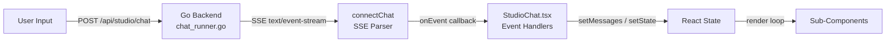
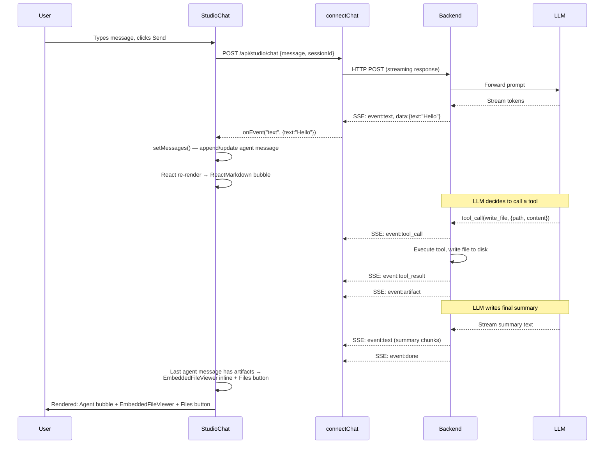
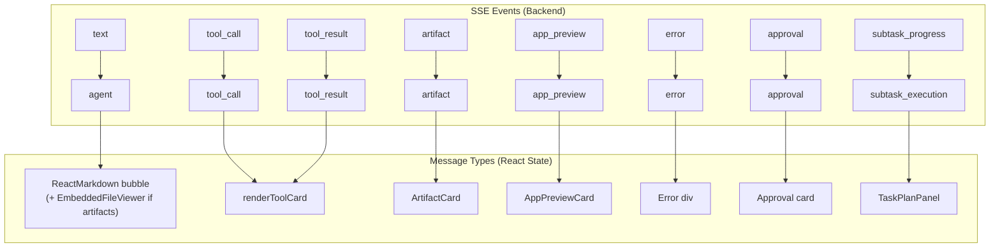
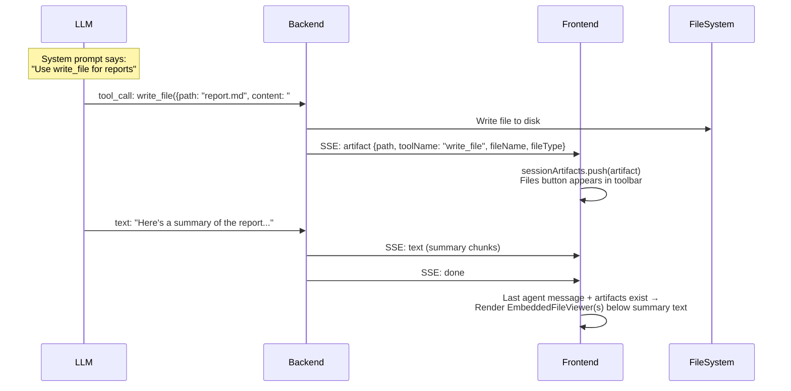
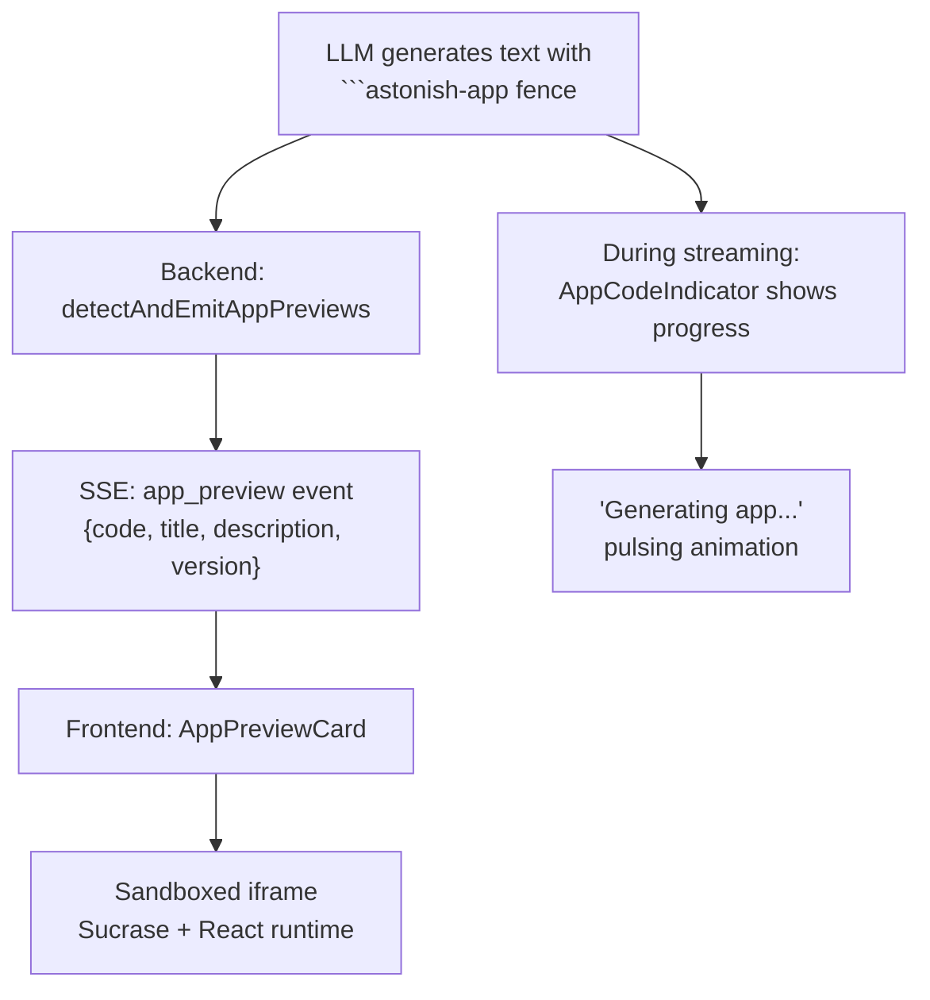
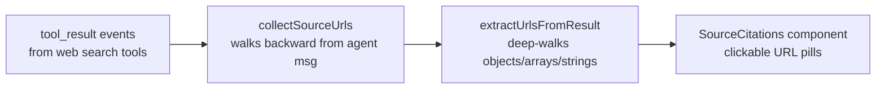
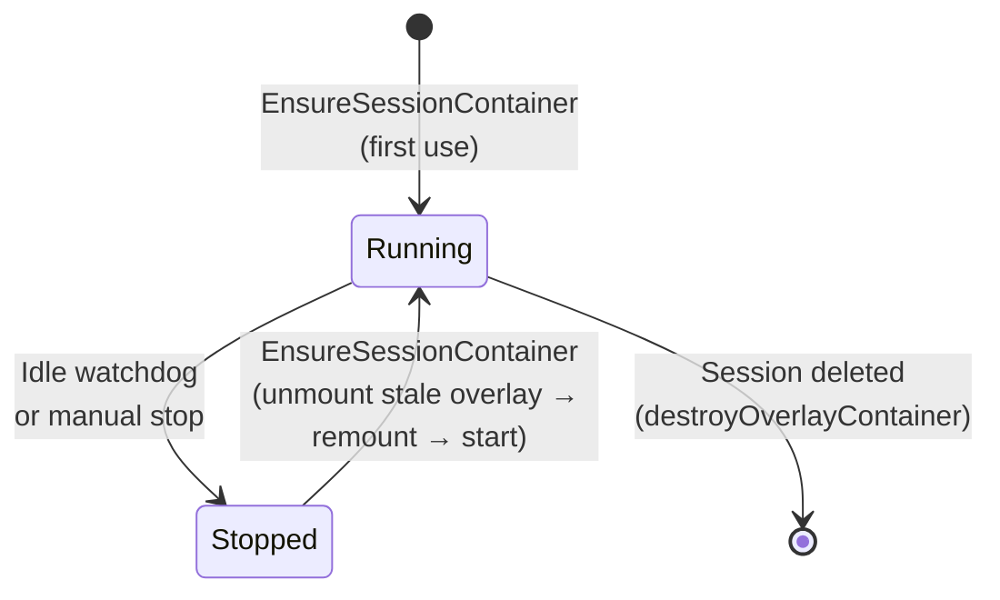

# Chat Rendering Pipeline

## Overview

The Studio Chat (`StudioChat.tsx`) is the primary user interface for Astonish. It orchestrates 17 sub-components, manages 35 state variables, handles 29 SSE event types from the backend, and renders 21 distinct message types. This document is the authoritative reference for how the pipeline works, how to extend it, and what rules must be followed.

**Target audience:** Developers adding new SSE event types, new rendering components, or modifying the report/app/artifact pipelines.

## End-to-End Data Flow

The rendering pipeline is a unidirectional flow from user input to rendered UI:



### Detailed pipeline:



## SSE Transport Layer

SSE parsing is implemented **manually** using the `ReadableStream` API in `web/src/api/studioChat.ts` -- not the browser's native `EventSource`. This is because the initial request is a `POST` (EventSource only supports GET).

Two functions share identical parsing logic:

| Function | HTTP Method | Endpoint | Purpose |
|----------|------------|----------|---------|
| `connectChat()` | POST | `/api/studio/chat` | Send a new message, receive streaming response |
| `connectChatStream()` | GET | `/api/studio/sessions/{id}/stream` | Reconnect to an active background runner |

**Parsing flow:**
1. Read chunks from `response.body.getReader()` via `TextDecoder`
2. Accumulate into a buffer, split on `\n\n` (SSE block delimiter)
3. For each block: extract `event:` type and `data:` payload from lines
4. `JSON.parse(data)` and call `onEvent(eventType, parsedData)`
5. On stream end, call `onDone()`

**Both connect paths must have identical event handlers.** When adding a new event type, the `case` must be added to both the `connectChat` handler (in `sendMessage`) and the `connectChatStream` handler (in the reconnect logic). Missing one causes events to be silently dropped on reconnect.

## SSE Event Types

The backend emits **27 distinct event types** across `chat_runner.go` and `chat_handlers.go`. The frontend handles **29 case entries** (some events like `app_done`/`app_saved` share a handler).

### Core Chat Events

| Event | Data Shape | Frontend Action |
|-------|-----------|----------------|
| `session` | `{sessionId, isNew}` | Store session ID, update sidebar |
| `text` | `{text}` | Append to streaming agent message |
| `done` | `{}` | Finalize streaming text, set `isStreaming=false` |
| `error` | `{error}` | Add error message |
| `error_info` | `{title, reason, suggestion, originalError}` | Add structured error card |
| `usage` | `{input, output, total}` | Update token usage display |

### Tool Execution Events

| Event | Data Shape | Frontend Action |
|-------|-----------|----------------|
| `tool_call` | `{name, args, id}` | Add tool call card (collapsible) |
| `tool_result` | `{name, result, id}` | Add tool result card (collapsible) |
| `approval` | `{name, args, options}` | Show approval card with Approve/Deny buttons |
| `auto_approved` | `{name}` | Show auto-approved badge |

### Artifact & File Events

| Event | Data Shape | Frontend Action |
|-------|-----------|----------------|
| `artifact` | `{path, toolName, fileName, fileType}` | Add to `sessionArtifacts`, show ArtifactCard |
| `image` | `{data, mimeType}` | Render inline `` |

### App Preview Events

| Event | Data Shape | Frontend Action |
|-------|-----------|----------------|
| `app_preview` | `{code, title, description, version, appId}` | Finalize streaming text, render AppPreviewCard |
| `app_done` / `app_saved` | `{name, path}` | Clear active app, show saved confirmation |

### Delegation Events

| Event | Data Shape | Frontend Action |
|-------|-----------|----------------|
| `subtask_progress` | `{tasks[], events[]}` | Update TaskPlanPanel |
| `fleet_progress` | `{agents[], events[], status}` | Update FleetExecutionPanel |
| `fleet_redirect` | `{message}` | Open fleet dialog |
| `fleet_plan_redirect` | `{message}` | Open fleet template picker |
| `drill_redirect` | `{name, message}` | Switch to drill wizard |
| `drill_add_redirect` | `{message}` | Switch to drill-add wizard |

### Planning & Flow Events

| Event | Data Shape | Frontend Action |
|-------|-----------|----------------|
| `distill_preview` | `{yaml, flowName, description, tags, explanation}` | Render DistillPreviewCard |
| `distill_saved` | `{filePath, runCommand}` | Show flow-saved confirmation |
| `flow_output` | `{content}` | Render as agent message |

### Other Events

| Event | Data Shape | Frontend Action |
|-------|-----------|----------------|
| `thinking` | `{text}` | Show thinking indicator |
| `retry` | `{attempt, maxRetries, reason}` | Show retry badge |
| `session_title` | `{title, sessionId}` | Upsert sidebar session title (may fire twice: provisional then refined) |
| `new_session` | `{sessionId}` | Switch to new session |
| `system` | `{text}` | Show system info card |
| `model_changed` | `{sessionId, pinnedProvider, pinnedModel, effectiveProvider, effectiveModel, credentialsAvailable}` | Refresh model status badge (no message added) |

The `model_changed` event is emitted by `PatchSessionModelHandler` (`pkg/api/chat_handlers.go`) when a per-session model pin is updated while a runner is actively streaming. It is purely informational — no message is added to the chat log; the SPA re-renders the model badge only. When no runner is registered for the session (e.g. pin change between turns), the event is silently skipped and the SPA re-fetches via `GET /api/studio/sessions/{id}/model-status` on the next poll. See DECISION-3/DECISION-4 in `.omo/notepads/per-chat-app-model-pin/decisions.md` for the missing-credential soft-fallback contract that shapes the payload.

## Message Types and Component Mapping

Each SSE event handler calls `setMessages()` to add a typed message to the React state. The render loop maps each message type to a component:



### Full type-to-component table

| Message Type | Component | Notes |
|-------------|-----------|-------|
| `user` | Inline chat bubble | "You" label, plain text |
| `agent` | `ReactMarkdown` bubble + `EmbeddedFileViewer` | Last agent message renders embedded file viewers when artifacts exist |
| `tool_call` | `renderToolCard()` | Collapsible tool invocation card |
| `tool_result` | `renderToolCard()` | Collapsible tool response card |
| `browser_handoff` | `BrowserView` | VNC proxy + page info |
| `image` | Inline `` | Base64 data URI |
| `error` | Red error `<div>` | Plain text |
| `error_info` | Structured error card | Title, reason, suggestion, raw error |
| `approval` | Yellow approval card | Approve/Deny action buttons |
| `auto_approved` | Green badge | Auto-approved notification |
| `thinking` | Thinking note | Italic indicator |
| `fleet_execution` | `FleetExecutionPanel` | Multi-agent progress |
| `plan` | `PlanPanel` | Goal + step checklist |
| `subtask_execution` | `TaskPlanPanel` | Delegation progress |
| `fleet_message` | Fleet chat bubble | Agent-colored markdown bubble |
| `system` | System info card | Info icon + markdown |
| `retry` | Orange retry badge | Attempt counter |
| `artifact` | `ArtifactCard` | File notification (suppressed when embedded in last agent bubble) |
| `app_preview` | `AppPreviewCard` | Sandboxed iframe with live React preview |
| `distill_preview` | `DistillPreviewCard` | Flow YAML preview with save button |
| `distill_saved` | Saved confirmation card | File path + copy button |
| `app_saved` | Saved confirmation card | App name + path |

## The Report Pipeline

Reports are rendered inline inside the last agent message bubble using `EmbeddedFileViewer`. There is no separate "ResultCard" wrapper -- artifacts appear directly below the agent's summary text.

### How it works



### The `embeddedArtifactPaths` memo

When the session is done streaming and has artifacts, the `embeddedArtifactPaths` set is populated with all session artifact paths. This suppresses the inline `ArtifactCard` for those files, since they're already shown as `EmbeddedFileViewer`s inside the last agent message bubble.

The logic is simple: if `!isStreaming` and `sessionArtifacts.length > 0`, find the last non-streaming agent message and embed all artifact paths.

### Export pipeline

| Format | Mechanism | Speed |
|--------|----------|-------|
| **Markdown** | `<a>.click()` → `GET /api/studio/artifacts` → serve file from disk | Instant |
| **DOCX** | Client-side: `@m2d/remark-docx` + `file-saver` `saveAs()` | ~1s |
| **PDF** | `fetch()` → `GET /api/studio/artifacts/pdf` → headless Chrome (go-rod) → blob → `saveAs()` | 5-15s |

PDF export uses `fetch()` + blob download (not `<a>.click()` navigation) because the backend PDF generation takes 5-15 seconds. The `<a>.click()` pattern causes the browser to show "Site wasn't available" for slow responses. The `fetch()` approach shows a loading spinner on the Download button during generation.

## The Report Pipeline

Reports use a **two-step contract** combining `write_file` (which produces the file on disk and an `artifact` SSE event) with an explicit `astonish-report` fence emitted in the agent's reply text. Both signals are required: the file is the *content*, the fence is the *intent*.

This design replaces an earlier heuristic ("any last-turn markdown artifact is a report"), which produced incorrect promotions whenever an agent edited a markdown file incidentally during a non-report task. It also replaces an even earlier alternative ("`astonish-report` fence carries the markdown content inline"), which was rejected because the file had to live on disk anyway for the Files panel, the artifact API, and PDF/DOCX export.

```mermaid
graph TD
    A["LLM emits text +<br/>```astonish-report path: ... ``` fence"] --> B
    A2["LLM calls write_file(path, ...)"] --> C[artifact SSE event]
    B[Backend: detectAndEmitReportMarkers]
    B -->|fence path matches a same-turn artifact| D["report_marker SSE event<br/>{path, title}"]
    B -->|persistReportMarker| E[Session log:<br/>'[report_marker]{...}']
    D --> F["Frontend: flips ArtifactMessage.isReport<br/>and SessionArtifact.isReport"]
    E --> G["Session-detail GET:<br/>collectReportMarkers + joinReportMarkers<br/>projects IsReport onto ArtifactInfo"]
    C --> H["Frontend: ArtifactMessage rendered<br/>(by default as compact ArtifactCard)"]
    F --> I["StudioChat embeddedArtifactPaths gate:<br/>last-turn AND fileType==='Markdown' AND isReport"]
    G --> I
    H --> I
    I -->|gate passes| J[EmbeddedFileViewer<br/>inline in last agent bubble]
    I -->|gate fails| K[ArtifactCard<br/>compact download tile]
```

### Gate rules (the contract surface)

A markdown artifact is promoted to inline `EmbeddedFileViewer` rendering **iff all three** conditions hold:

1. The artifact event was emitted in the **last turn** (after the most recent user message). Earlier-turn edits never embed.
2. `fileType === 'Markdown'`. Code, configs, scripts, JSON, etc. always render as `ArtifactCard`.
3. `isReport === true`. This flips only when the agent emits an `astonish-report` fence whose `path` matches the artifact's path; the backend's `detectAndEmitReportMarkers` validates the match before emitting `report_marker`.

Any artifact failing any of these conditions falls back to the compact `ArtifactCard` download tile. There is no other path to inline rendering.

### Fence shape

```
` + "```" + `astonish-report
path: /absolute/path/to/file.md
title: Optional human-readable title
` + "```" + `
```

- `path` is required; it MUST equal the absolute path passed to `write_file`/`edit_file` in the same turn. Mismatches are logged and dropped.
- `title` is optional; when present, `EmbeddedFileViewer` uses it as the header label and the basename becomes a tooltip.
- Unknown frontmatter keys are tolerated silently for forward compatibility.
- The fence is **stripped** from displayed agent prose by both the backend (`stripReportMarkerFences`) and the frontend (regex inside `StudioChat.tsx`); it is never displayed to the user.

### Persistence and replay

`persistReportMarker` writes a `[report_marker]{...}` text event to the session log alongside the agent's prose, mirroring the `[app_preview]` and `[distill_preview]` patterns. On session-detail load:

1. `collectReportMarkers` walks the events and rebuilds `path → title` map.
2. `joinReportMarkers` projects the map onto the `[]ArtifactInfo` returned by `collectArtifacts`, flipping `IsReport` and filling `ReportTitle`.

The frontend's playback `tryParseReportMarkerMessage` recognises the persisted text events as marker records (not chat content) and skips them, preventing both rendering and coalescing into surrounding agent prose.

### Why this design over alternatives

| Alternative | Why rejected |
|---|---|
| Agent message containing a long write_file → embed (the `b5310ae` heuristic) | False positives on incidental edits during multi-turn tasks. |
| `astonish-report` fence carries inline markdown content (no `write_file`) | No file on disk → no Files panel, no artifact API, no PDF/DOCX export, no `EmbeddedFileViewer.fetchArtifactContent`. |
| Single SSE event combining artifact + report-flag | Tools fire before agent text, so the fence is parsed *after* the artifact event has already been emitted. Splitting into two events keeps the per-event semantics clean and parallels `app_preview`. |
| Frontend-only fence detection | Backend persistence and session-detail reload would re-derive state from raw text on every load — fragile and parser-coupled. The current split lets backend canonicalize once and persist the structured marker.

## The App Preview Pipeline

Visual apps use a different pipeline from reports. The LLM wraps generated React JSX in an `astonish-app` code fence, which the backend detects and emits as an `app_preview` event.



### Streaming progress indicator

During streaming, the agent message contains a partial `astonish-app` fence. The render loop detects this with a regex:

```typescript
const appFenceRe = /```astonish-app\s*\n([\s\S]*?)(?:\n```|$)/
```

When matched, it renders an `AppCodeIndicator` (pulsing "Generating app..." with expandable code view) instead of the raw fence text. After streaming completes, the `app_preview` event arrives and replaces the indicator with the full `AppPreviewCard`.

**This streaming interceptor is intentionally `astonish-app`-only.** Do not generalize it to other fence types without implementing the full backend event + frontend handler + ResultCard integration for that type.

## The Source Citations Pipeline

When the agent uses web search tools during a turn, source URLs are collected and displayed as clickable citation pills below the ResultCard.



This is a **frontend heuristic** (not a backend event). The function `collectSourceUrls(messages, agentIndex)` walks backward from the agent message, finds `tool_result` messages from web search tools (matched by `WEB_SEARCH_PATTERNS`), and extracts URLs using a regex. URLs are deduplicated and filtered (no localhost, no API endpoints).

`SourceCitations` renders below every agent message bubble that has source URLs.

## Adding a New SSE Event Type

Follow these steps when adding a new event type to the pipeline:

### Step 1: Backend -- Emit the event

In `pkg/api/chat_runner.go` (or `chat_handlers.go` for slash command events):

```go
cr.emitEvent("my_new_event", map[string]any{
    "field1": value1,
    "field2": value2,
})
```

### Step 2: Frontend -- Define the message type

In `web/src/components/chat/chatTypes.ts`:

```typescript
export interface MyNewMessage {
  type: 'my_new_event'
  content: string
  field1: string
  field2: number
}
```

Add it to the `ChatMsg` union type.

### Step 3: Frontend -- Add SSE handlers (BOTH connect paths)

In `web/src/components/StudioChat.tsx`, add a `case` in **both** the `connectChat` handler and the `connectChatStream` handler:

```typescript
case 'my_new_event':
  setMessages((prev: ChatMsg[]) => [...prev, {
    type: 'my_new_event',
    content: data.content as string,
    field1: data.field1 as string,
    field2: data.field2 as number,
  } as MyNewMessage])
  break
```

### Step 4: Frontend -- Add rendering

In the render loop (`messages.map((msg, index) => { ... })`):

```typescript
if (msg.type === 'my_new_event') {
  const myMsg = msg as MyNewMessage
  return (
    <div key={index}>
      <MyNewComponent field1={myMsg.field1} field2={myMsg.field2} />
    </div>
  )
}
```

### Step 5: Write tests

1. **Fixture JSON** -- Create `web/src/test/fixtures/scenarios/<category>/my-new-event.json` with simulated SSE events
2. **Frontend scenario test** -- Create `web/src/test/scenarios/my-new-event.test.tsx` that loads the fixture, renders StudioChat, and asserts the component appears
3. **Backend integration test** -- Add a test in `pkg/api/integration_test.go` or `integration_gaps_test.go` using `MockLLM` to verify the event is emitted correctly
4. **Prompt contract** (if the event depends on system prompt instructions) -- Add an assertion in `pkg/agent/system_prompt_contracts_test.go`

See `docs/architecture/testing-chat-scenarios.md` for the full testing infrastructure.

## Sandbox Container Lifecycle

When the PDF export or browser tools need headless Chrome, they use the session's sandbox container. Containers can be in three states:



**Critical invariant:** When restarting a stopped container, the overlay filesystem mount must be unmounted and remounted before starting. After a container stops, the kernel's dentry cache for the overlay can become stale -- `ls rootfs/` returns empty even though `/proc/mounts` shows the overlay as mounted. Without a fresh remount, the container starts with an empty rootfs and crashes immediately.

This is handled in `EnsureSessionContainer` (`pkg/sandbox/lifecycle.go`):

```go
// Container stopped — unmount stale overlay before remounting
_ = umountOnSandboxHost(containerRootfs)
ensureOverlayMounted(client, containerName, ...)  // fresh mount
client.StartInstance(containerName)
```

## Rules and Invariants

These rules were established through bugs and fixes. Violating them will break the pipeline.

### Report rendering

1. **Reports must use `write_file`** -- The system prompt instructs the LLM to save reports to disk via `write_file`, then present a concise summary inline. Never use inline fences for reports.
2. **Artifacts render as `EmbeddedFileViewer`** inside the last agent message bubble when `sessionArtifacts.length > 0` and the session is done streaming.
3. **`embeddedArtifactPaths` suppresses inline `ArtifactCard`s** for files already shown as embedded viewers in the agent bubble.

### Event handling

4. **Both connect paths must stay in sync** -- `connectChat` (new messages) and `connectChatStream` (reconnect) have parallel switch statements. Every new event type must be added to both.
5. **Finalize streaming text before special events** -- `app_preview` and similar events that arrive mid-stream must finalize the current streaming text first (commit the partial agent message) before adding their own message.

### Frontend heuristics vs backend events

6. **Prefer backend events for new features** -- Frontend heuristics (like `collectSourceUrls`) exist for legacy reasons where the backend doesn't emit a dedicated event. For new features, emit a backend event rather than adding a frontend heuristic.
7. **The `astonish-app` streaming interceptor is app-only** -- Do not generalize the fence regex to match other `astonish-*` patterns without implementing the complete pipeline (backend detection → SSE event → frontend handler → component rendering).

### Export

8. **PDF export uses `fetch()` + `saveAs()`, not `<a>.click()`** -- The backend PDF generation takes 5-15 seconds. The `<a>.click()` navigation pattern causes "Site wasn't available" errors for slow responses. Always use `fetch()` → blob → `saveAs()` for slow download endpoints.

### Sandbox

9. **Unmount stale overlays before restarting stopped containers** -- `ensureOverlayMounted` must force a remount (unmount first) when restarting a stopped container. The `IsOverlayMounted` check alone is insufficient because the mount can have stale dentries.

## File Reference

### Backend

| File | Role |
|------|------|
| `pkg/api/chat_runner.go` | SSE event emission, tool execution, app preview detection |
| `pkg/api/chat_handlers.go` | HTTP handler, slash commands, redirect events |
| `pkg/api/session_handlers.go` | Artifact serving, PDF generation endpoint |
| `pkg/api/run_handler.go` | PDF browser manager, sandbox container resolution |
| `pkg/agent/guidance_content.go` | System prompt (report rules, app rules) |
| `pkg/pdfgen/chrome.go` | Headless Chrome PDF generation via go-rod |
| `pkg/sandbox/lifecycle.go` | Container lifecycle, overlay mount management |

### Frontend

| File | Role |
|------|------|
| `web/src/components/StudioChat.tsx` | Main component -- SSE handlers, state, render loop |
| `web/src/components/chat/chatTypes.ts` | Message type interfaces and ChatMsg union type |
| `web/src/api/studioChat.ts` | `connectChat()`, `connectChatStream()`, artifact APIs |
| `web/src/components/chat/EmbeddedFileViewer.tsx` | Inline file viewer with markdown rendering, download/export |
| `web/src/components/chat/AppPreviewCard.tsx` | Sandboxed React preview in iframe |
| `web/src/components/chat/AppCodeIndicator.tsx` | Streaming progress for app generation |
| `web/src/components/chat/FilePanel.tsx` | Full-screen file viewer overlay |
| `web/src/components/chat/ArtifactCard.tsx` | Inline file notification card |
| `web/src/components/chat/TaskPlanPanel.tsx` | Delegation progress panel |
| `web/src/components/chat/FleetExecutionPanel.tsx` | Fleet multi-agent progress |
| `web/src/components/chat/PlanPanel.tsx` | Plan goal + step checklist |
| `web/src/components/chat/DistillPreviewCard.tsx` | Flow YAML preview |
| `web/src/components/chat/BrowserView.tsx` | VNC browser handoff |

### Test Infrastructure

| File | Role |
|------|------|
| `web/src/test/helpers/sseSimulator.ts` | Creates ReadableStream from fixture events |
| `web/src/test/helpers/mockFetch.ts` | Shared fetch interceptor with queue support |
| `web/src/test/helpers/renderChat.tsx` | StudioChat test wrapper |
| `web/src/test/scenarios/scenarioSetup.tsx` | Shared vi.mock() declarations |
| `web/src/test/fixtures/scenarios/` | JSON fixture files for SSE simulation |
| `pkg/api/integration_test.go` | Backend integration tests with MockLLM |
| `pkg/agent/system_prompt_contracts_test.go` | Prompt contract tests + golden file |
