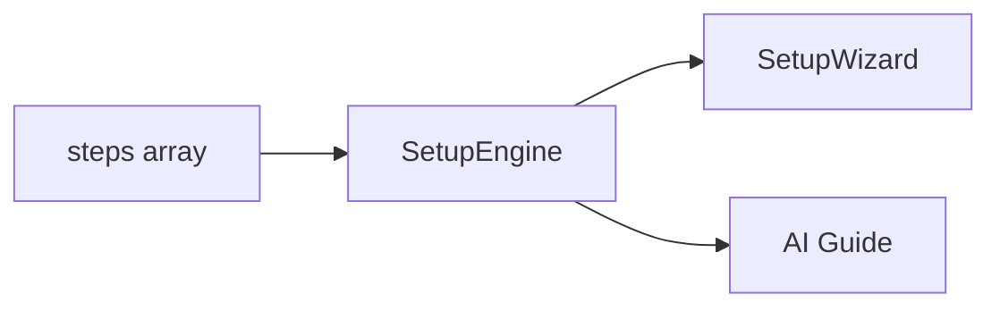

# Fleet Setup Profiles

Setup profiles decouple **plan creation guidance** from fleet templates. A template defines *who* the team is; a setup profile defines *how* to wire a plan instance (channel, credentials, sandbox, artifacts).

## Layers

| Layer | Owns | Example |
|-------|------|---------|
| **Template** | Agents, communication graph, fleet settings | `software-dev` |
| **Setup profile** | Ordered steps, field schema, per-step prompts/tools | `software-development` |
| **Plan** | Captured answers for one deployment | `billing-api` plan |

Templates reference profiles:

```yaml
setup_profile: software-development
```

Bundled profiles ship in `pkg/fleet/bundled/setup-profiles/`. Bundled keys are immutable (same pattern as fleet templates).

## Steps as source of truth

Each profile is an ordered `steps[]` array. **Steps are the contract** — fields, prompts, tools, and visuals live on each step. There is no monolithic profile-level wizard prose.



The form wizard and chat AI Guide read the **same step definitions**. Chat is scoped to the **current incomplete step only**; advancing requires `update_setup_draft` after server-side validation passes.

## Setup profile schema

### Profile-level fields

| Field | Purpose |
|-------|---------|
| `intro_prompt` | Optional 2–3 sentence session preamble for chat |
| `pinned_tool_groups` | Default tool groups; each step can extend |
| `channel_types` | Registry for channel enum labels, descriptions, credential requirements |
| `wizard_prompt` | **Deprecated** — ignored by engine; put instructions on steps |

### Step schema

Each step may include:

| Field | Purpose |
|-------|---------|
| `id`, `title`, `type` | Identity and renderer selection |
| `icon`, `summary` | Wizard stepper UI hints |
| `prompt` | Full LLM instructions for this step (chat + AI guide) |
| `content` | Markdown for `info` steps (wizard + profile viewer) |
| `fields[]` | Form fields with `maps_to` paths (e.g. `plan.channel.type`) |
| `tools[]` | Explicit tool names for pills and chat hints |
| `pinned_tool_groups[]` | Per-step tool groups (merged with profile defaults) |
| `when` | Conditional visibility (e.g. `channel.type == 'github_issues'`) |
| `provisioner` | Provision step backend binding |

### Step types

| Type | Purpose |
|------|---------|
| `info` | Markdown overview; requires `_ack` in collected values |
| `form` | Generic fields (channel, identity, artifacts, …) |
| `credentials` | Credential picker + `credential_ref` fields |
| `provision` | Sandbox/container provisioning |
| `agent_select` | Agent inclusion checkboxes (names from linked template at runtime) |
| `review` | Collected summary + finalize |

Legacy type `template_agents` is normalized to `agent_select`.

### Tool catalog

`pkg/fleet/setup_tool_catalog.go` is the canonical registry of setup tool names → group, label, description. Step presets in `setup_step_presets.go` supply default tools/groups per step type.

## Engine

`pkg/fleet/setup_engine.go` + `setup_prompt.go`:

- `CurrentStep`, `StepCompletion` — progress tracking
- `ComposeStepPrompt` — step-scoped chat prompt (not full profile)
- `ComposeSessionIntro` — optional `intro_prompt` only
- `StepToolGroups`, `StepTools` — merged per-step tool availability
- Validates step completion and `when` conditions
- Maps collected values → `SetupPlanBuild` → `FleetPlan`

**Strict chat progression:** the agent must call `get_setup_profile(draft_id)` to see completion state, then `update_setup_draft(step_id, values)` when fields are complete. Validation errors block advance; the prompt instructs the agent to stay on the current step until validation passes.

## API

- `GET /api/fleet-setup-profiles` — list profiles
- `GET /api/fleet-setup-profiles/{key}` — full profile
- `GET /api/fleet-setup-profiles/{key}/steps/{stepId}` — step + resolved tools/groups
- `GET /api/fleet-setup/tool-catalog` — all known setup tools (editor pills)
- `PUT /api/fleet-setup-profiles/{key}` — save custom profile (JSON)
- `DELETE /api/fleet-setup-profiles/{key}` — delete custom profile
- `POST /api/fleet-setup-profiles/{key}/clone` — clone bundled or custom profile to a new key
- `GET/PUT /api/fleet-setup-profiles/{key}/yaml` — read/edit profile as YAML
- `POST /api/fleet-setup/drafts` — start draft from template
- `PATCH /api/fleet-setup/drafts/{id}` — update collected values; returns `{ valid, errors[], next_step }`
- `POST /api/fleet-setup/drafts/{id}/validate-step` — validate one step
- `POST /api/fleet-setup/drafts/{id}/finalize` — build and save plan

Chat SSE (`fleet_plan_redirect`) emits step-scoped `wizard_system_prompt`, `pinned_tool_groups`, and `current_setup_step`.

## UI

- **Bundled Setup Profiles** / **Your Setup Profiles** sidebar sections (mirrors templates)
- Clone bundled profiles to create editable copies; **New Setup Profile** scaffolds from `generic`
- **SetupProfileDetail** — timeline step editor with Overview / Fields / Prompt / Tools tabs; YAML tab for power users
- **SetupWizard** — stepper layout with markdown info steps, channel cards, credential picker, tool pills
- **Create Plan** on template detail opens `SetupWizard` (form-driven)
- **AI Guide** / `/fleet-plan` uses the same profile via chat (strict step progression)

## Authoring guide

1. **Never add profile-level wizard prose** — put instructions on the relevant step's `prompt`.
2. Use `content` for markdown shown in the wizard on `info` steps.
3. Declare `tools` and `pinned_tool_groups` on steps that need credentials, provisioning, or plan validation.
4. Add new channel types via `channel_types` registry, not hardcoded UI.
5. Use `agent_select` (not template merge) for optional agent filtering; agent names come from the draft's linked template at runtime.

## Migration

- `plan_wizard` on templates is deprecated; use `setup_profile` instead
- `wizard_prompt` on profiles is deprecated; split into per-step `prompt` / `content`
- Templates with neither field use bundled `generic` profile
- Existing plans are unaffected

## Bundled keys

- `software-development` — full SDLC setup (channel, credentials, provisioning, artifacts)
- `generic` — minimal setup for any template
