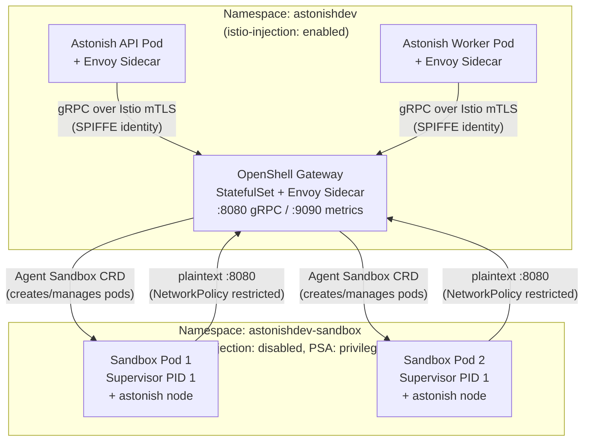
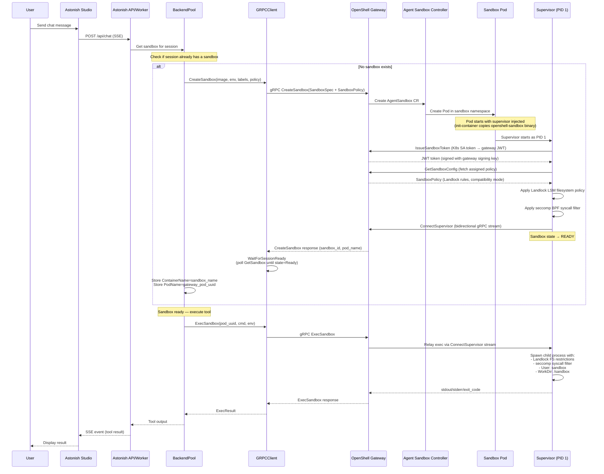
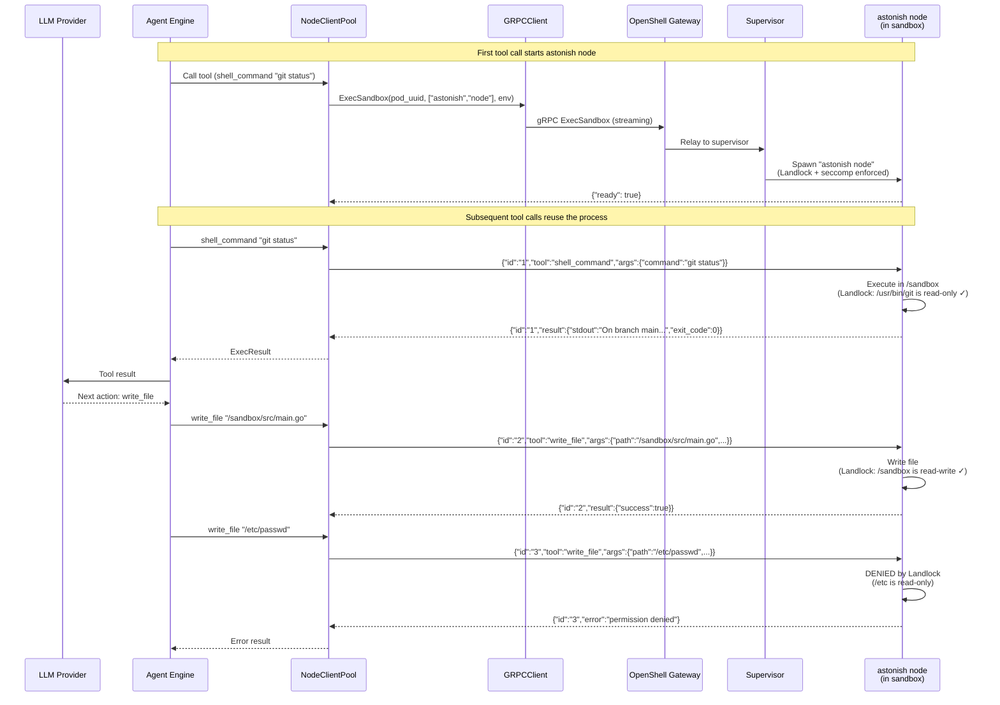
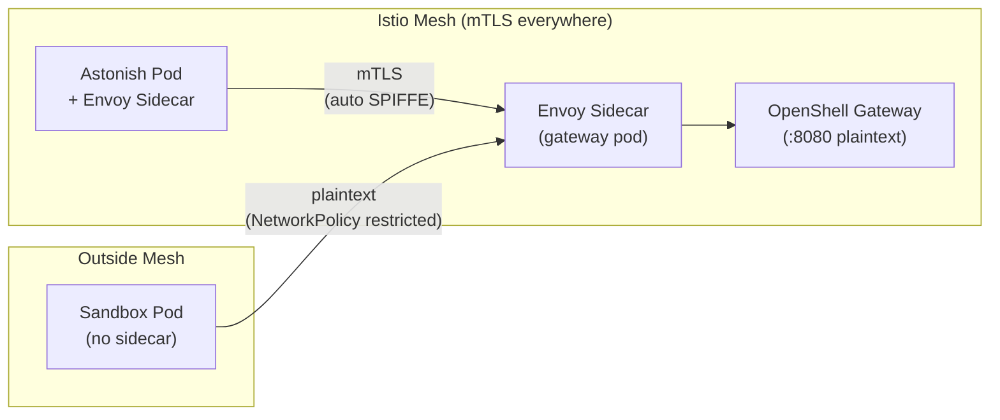

# OpenShell Sandbox Backend

> **Status: Deployed and operational.**
> NVIDIA OpenShell is integrated as a Helm subchart and deployed in the
> same namespace as Astonish. Istio manages all service-to-service
> authentication (mTLS via SPIFFE), eliminating custom cert management.

---

## 1. Context & Motivation

The K8s backend (`pkg/sandbox/k8s/`) creates and manages sandbox pods
directly via the Kubernetes API. This works well for single-tenant
clusters but has limitations in regulated or multi-tenant environments:

- **No in-pod process isolation.** Once code executes inside the pod, it
  has full access to the overlay filesystem, can make arbitrary syscalls,
  and has unrestricted network egress within the pod's NetworkPolicy.
- **No per-process audit trail.** Kubernetes audit logs record pod/exec
  events but not what commands run or what files they access.
- **No inference routing control.** Agent tool calls that reach external
  LLM APIs are not mediated by any privacy or compliance layer.
- **No credential isolation.** Environment variables visible to PID 1 are
  visible to all exec'd processes.

NVIDIA OpenShell (https://github.com/NVIDIA/OpenShell) provides:

| Layer | Mechanism | What It Protects |
|-------|-----------|-----------------|
| **Filesystem** | Landlock LSM | Per-process read/write/exec access to paths |
| **Syscalls** | seccomp BPF | Blocks mount, mknod, pivot_root, ptrace for agent code |
| **Network** | Network namespace + policy proxy | Per-destination, per-binary, L7-aware egress control |
| **Audit** | OCSF structured logging | Every process spawn, file access denial, network connection |

---

## 2. Architecture Overview

OpenShell is deployed as a **Helm subchart** in the same namespace as
Astonish. Istio provides mesh-level mTLS between the Astonish control
plane and the OpenShell gateway. Sandbox pods run in a separate namespace
without Istio sidecars — they connect to the gateway via plaintext,
protected by NetworkPolicy.



### Component Responsibilities

#### NVIDIA Provides (Helm Subchart)

| Component | Image / Artifact | Purpose |
|-----------|-----------------|---------|
| **Gateway** | `ghcr.io/nvidia/openshell/gateway:0.0.63` | Sandbox lifecycle, exec relay, policy distribution |
| **Supervisor** | `ghcr.io/nvidia/openshell/supervisor:0.0.63` | PID 1 inside sandboxes, Landlock/seccomp enforcement |
| **Helm Chart** | `oci://ghcr.io/nvidia/openshell/helm-chart:0.0.63` | Deploys gateway + RBAC (subchart of Astonish) |

#### Astonish Provides

| Component | Location | Purpose |
|-----------|----------|---------|
| **OpenShell Backend** | `pkg/sandbox/openshell/` | Implements `SandboxBackend` interface via gRPC client |
| **Custom Sandbox Image** | `docker/sandbox-openshell/Dockerfile` | NVIDIA base + Astonish agent binary |
| **Istio Resources** | `templates/openshell/istio.yaml` | PeerAuth + AuthorizationPolicies |
| **NetworkPolicy** | `templates/openshell/networkpolicy.yaml` | Sandbox egress restriction |
| **Namespace Config** | `templates/sandbox/namespace.yaml` | PSA auto-promotion, Istio injection disabled |

---

## 3. Sandbox Spin-up Protocol

When a user sends a chat message that triggers tool execution, the system
provisions a sandbox through the following sequence:



### Key Protocol Details

**AlreadyExists Handling:** If `CreateSandbox` returns `ALREADY_EXISTS`
(gRPC code 6), the client adopts the existing sandbox — it calls
`GetSandbox` to retrieve the current state and proceeds as if it had
just created it. This handles restarts and race conditions gracefully.

**WaitForSessionReady:** After `CreateSandbox` returns, the client polls
`GetSandbox` until the sandbox reaches `Ready` state. The supervisor must
complete token exchange, policy fetch, and Landlock setup before the
gateway marks it ready. Typical time: 5-11 seconds.

**Dual-Field Routing:** The session store maintains two identifiers:
- `ContainerName` = sandbox name (used for `GetSandbox`, `DeleteSandbox`)
- `PodName` = gateway's internal UUID (used for `ExecSandbox`)

This is because the gateway uses different identifiers for lifecycle
operations (human-readable name) vs exec routing (internal UUID that
maps to the supervisor's relay stream).

---

## 4. Agent Tool Execution

Once a sandbox is ready, the `astonish node` process runs as a
long-lived NDJSON-over-stdio tool server inside the sandbox. All
tool calls from the agent are proxied through this process:



### How Landlock Enforcement Works

The supervisor applies Landlock rules **before** spawning `astonish node`.
Every child process inherits these restrictions at the kernel level — the
`astonish node` process cannot bypass them regardless of what the agent
tries to execute. This is defense-in-depth beyond the container boundary:

- Even if the agent finds a container escape (e.g., via a kernel bug),
  the Landlock policy limits what the escaped process can access.
- The agent cannot `chmod` or `chown` its way past Landlock — it's a
  kernel-level mandatory access control.
- `best_effort` mode means if the kernel lacks Landlock support, the
  supervisor still starts (graceful degradation) but logs a warning.

---

## 5. Landlock Filesystem Policy

The filesystem policy is defined in `pkg/sandbox/openshell/policy.go`
and passed to the gateway at sandbox creation time:

```go
func defaultSandboxPolicy() *SandboxPolicySpec {
    return &SandboxPolicySpec{
        Version: 1,
        Landlock: &LandlockSpec{
            Compatibility: "best_effort",
        },
        Filesystem: &FilesystemSpec{
            IncludeWorkdir: true,
            ReadOnly: []string{
                "/usr",
                "/bin",
                "/sbin",
                "/lib",
                "/lib64",
                "/etc",
                "/opt",
            },
            ReadWrite: []string{
                "/sandbox",
                "/tmp",
                "/var/tmp",
                "/home",
                "/run",
            },
        },
    }
}
```

### Path Access Matrix

| Path | Access | Purpose |
|------|--------|---------|
| `/sandbox` | Read-Write | Agent workspace (WORKDIR, `IncludeWorkdir: true`) |
| `/tmp`, `/var/tmp` | Read-Write | Temporary files for tool execution |
| `/home` | Read-Write | User home directories |
| `/run` | Read-Write | Runtime state (sockets, PIDs) |
| `/usr`, `/bin`, `/sbin` | Read-Only | System executables (git, node, python) |
| `/lib`, `/lib64` | Read-Only | Shared libraries |
| `/etc` | Read-Only | System configuration (resolv.conf, etc.) |
| `/opt` | Read-Only | Optional packages |
| `/root` | **Denied** | Not in policy — agent runs as user `sandbox` |
| `/proc`, `/sys`, `/dev` | **Not in Landlock** | Handled by container + seccomp |

**`IncludeWorkdir: true`** tells the supervisor to automatically add the
container's working directory (`/sandbox`) to the read-write list,
ensuring the agent always has write access to its workspace.

**`best_effort` compatibility** means Landlock degrades gracefully:
- If the kernel supports Landlock v4 → full enforcement
- If the kernel supports Landlock v1-v3 → partial enforcement (missing
  newer restrictions silently skipped)
- If the kernel has no Landlock → no enforcement, supervisor logs warning

---

## 6. Service Mesh Integration

### Overview

The OpenShell gateway is the bridge between the service mesh (Astonish
control plane) and non-mesh workloads (sandbox pods). It must accept
connections from both:

- **Mesh pods** (Astonish API/Worker) — arrive with mesh-provided mTLS
- **Non-mesh pods** (sandbox supervisors) — arrive as plaintext

The chart supports pluggable mesh configuration via `mesh.provider`:

```yaml
# values.yaml
mesh:
  provider: ""       # "" | "istio" (more meshes can be added)
```

| `mesh.provider` | What the chart renders |
|-----------------|----------------------|
| `""` (default) | No mesh resources. Operator manages mesh config manually or operates without a mesh. |
| `"istio"` | PeerAuthentication (PERMISSIVE on gateway) + AuthorizationPolicies + namespace labels (`istio-injection: disabled` on sandbox ns) |

For meshes not directly supported (e.g., Linkerd, Cilium), set
`mesh.provider: ""` and configure mesh resources manually. The key
requirement: **the gateway pod must accept both mTLS and plaintext on
port 8080**.

### Istio Configuration (mesh.provider: "istio")

When `mesh.provider: "istio"`, the gateway listens plaintext
(`openshell.server.disableTls: true`) and Istio provides all encryption:



**Rendered resources** (`templates/openshell/mesh-istio.yaml`):

**PeerAuthentication:**
- Mode: `PERMISSIVE` on the gateway pod only
- Allows the gateway's Envoy sidecar to accept both:
  - Istio mTLS from mesh pods (Astonish API/Worker)
  - Plaintext from non-mesh pods (sandbox supervisors)
- Rest of the namespace inherits mesh-wide STRICT mode

**AuthorizationPolicy — mesh peers** (`openshell-mesh-allow`):
- Selector: OpenShell gateway pods
- Rule: `principals: ["*"]` (any valid SPIFFE identity)
- Effect: Mesh pods get full unrestricted gRPC access

**AuthorizationPolicy — sandbox pods** (`openshell-sandbox-allow`):
- Selector: OpenShell gateway pods
- Rule: No `from` section (matches all traffic including unauthenticated)
- Restricted `to.operation.paths`:
  - `ConnectSupervisor`, `RelayStream`, `GetSandboxConfig`
  - `IssueSandboxToken`, `RefreshSandboxToken`, `RotateCredential`
  - `ReportPolicyStatus`, `GetSandboxProviderEnvironment`, `PushSandboxLogs`
  - `AcquireLease`, `RenewLease`, `Health`
- Effect: Non-mesh pods can only call supervisor callback methods

**Union model:** Istio ALLOW policies are additive. Mesh pods match both
policies → full access. Non-mesh pods match only the sandbox policy →
restricted to supervisor methods. A sandbox pod cannot call
`CreateSandbox` or `DeleteSandbox` on the gateway.

### Without a Mesh (mesh.provider: "")

When no mesh is configured:
- No mesh CRDs are rendered (no Istio/Linkerd dependency)
- Set `openshell.server.disableTls: false` to enable the gateway's
  built-in mTLS (the pkiInitJob generates certificates automatically)
- Configure Astonish's Go client with `GatewayTLS: true` and cert paths
- Or set `openshell.server.disableTls: true` for plaintext (dev only —
  no encryption, no authentication between Astonish and gateway)

### NetworkPolicy (mesh-agnostic)

The NetworkPolicy (`templates/openshell/networkpolicy.yaml`) is **always
rendered** when `sandbox.openshell.enabled=true`, regardless of mesh
provider. It restricts all egress from the sandbox namespace to:

1. OpenShell gateway in the control-plane namespace (port 8080/TCP)
2. Cluster DNS in kube-system (port 53/UDP+TCP)

All other egress is denied. This is a standard Kubernetes NetworkPolicy —
it requires only a CNI that supports NetworkPolicy enforcement (Calico,
Cilium, K3s kube-router, etc.), not a service mesh.

---

## 7. Configuration

### Helm Values

```yaml
# Service mesh (controls mesh-specific resources)
mesh:
  provider: istio  # "" | "istio"

# Sandbox backend
sandbox:
  enabled: true
  backend: openshell
  podSecurity: privileged  # Auto-promoted for openshell

  openshell:
    enabled: true
    image:
      repository: schardosin/astonish-sandbox-openshell
      tag: dev

# OpenShell subchart pass-through
openshell:
  server:
    disableTls: true  # Mesh handles encryption
    sandboxNamespace: "astonishdev-sandbox"
    sandboxImage: "schardosin/astonish-sandbox-openshell:dev"
```

### Go Config Struct

```go
type SandboxOpenShellConfig struct {
    GatewayAddr    string `yaml:"gateway_addr" json:"gateway_addr"`
    GatewayTLS     bool   `yaml:"gateway_tls" json:"gateway_tls"`
    ClientCertPath string `yaml:"client_cert_path,omitempty" json:"client_cert_path,omitempty"`
    ClientKeyPath  string `yaml:"client_key_path,omitempty" json:"client_key_path,omitempty"`
    CACertPath     string `yaml:"ca_cert_path,omitempty" json:"ca_cert_path,omitempty"`
    AuthToken      string `yaml:"auth_token,omitempty" json:"auth_token,omitempty"`
    SandboxImage   string `yaml:"sandbox_image,omitempty" json:"sandbox_image,omitempty"`
}
```

The TLS fields are optional — when using a service mesh with
`disableTls: true`, `GatewayTLS` is `false` and the cert paths are
empty. They exist for non-mesh environments where the client connects
directly with gateway-native mTLS.

---

## 8. Custom Sandbox Image

The Dockerfile at `docker/sandbox-openshell/Dockerfile` layers the
Astonish agent binary on top of the NVIDIA community sandbox base:

```dockerfile
FROM golang:1.24-alpine AS builder
COPY . /src
WORKDIR /src
RUN CGO_ENABLED=0 go build -ldflags="-s -w" -o /tmp/astonish .

FROM ghcr.io/nvidia/openshell-community/sandboxes/base:latest
COPY --from=builder /tmp/astonish /usr/local/bin/astonish
WORKDIR /sandbox
```

The base image includes: Python 3.14, Node.js 22, git, gh CLI, vim,
nano, and common developer tools. The `astonish` binary provides the
`astonish node` NDJSON tool server.

The sandbox container runs as UID 0 in its securityContext (required by
the supervisor for Landlock/seccomp setup), but the supervisor demotes
the agent process to user `sandbox` before spawning it.

---

## 9. Deployment Prerequisites

The following are **cluster-scoped prerequisites** not managed by the
Astonish Helm chart:

### 1. Istio

```bash
istioctl install --set profile=minimal
kubectl label namespace astonishdev istio-injection=enabled
```

### 2. Agent Sandbox CRD + Controller

```bash
kubectl apply -f https://github.com/kubernetes-sigs/agent-sandbox/releases/latest/download/manifest.yaml
```

### 3. Deploy Astonish (includes OpenShell subchart)

```bash
helm upgrade --install astonish deploy/helm/astonish \
  -n astonishdev --create-namespace \
  -f deploy/helm/astonish/values-myenv.yaml
```

This single command deploys:
- Astonish API + Worker deployments
- OpenShell gateway StatefulSet (subchart)
- Sandbox namespace with PSA labels + Istio injection disabled
- Istio PeerAuthentication + AuthorizationPolicies
- NetworkPolicy for sandbox egress restriction

---

## 10. gRPC Client

### GatewayClient Interface

```go
type GatewayClient interface {
    CreateSandbox(ctx context.Context, req CreateSandboxRequest) (*CreateSandboxResponse, error)
    GetSandbox(ctx context.Context, sandboxID string) (*GetSandboxResponse, error)
    DeleteSandbox(ctx context.Context, sandboxID string) error
    ExecSandbox(ctx context.Context, sandboxID string, cmd []string, env map[string]string) (*ExecResult, error)
    WaitForSessionReady(ctx context.Context, sandboxID string) error
    Close() error
}
```

### Domain Types

```go
type SandboxPolicySpec struct {
    Version    int             `json:"version"`
    Landlock   *LandlockSpec   `json:"landlock,omitempty"`
    Filesystem *FilesystemSpec `json:"filesystem,omitempty"`
    Process    *ProcessSpec    `json:"process,omitempty"`
    Network    *NetworkPolicySpec `json:"network,omitempty"`
}

type LandlockSpec struct {
    Compatibility string `json:"compatibility"` // "best_effort" | "strict"
}

type FilesystemSpec struct {
    IncludeWorkdir bool     `json:"include_workdir"`
    ReadOnly       []string `json:"read_only,omitempty"`
    ReadWrite      []string `json:"read_write,omitempty"`
}

type CreateSandboxRequest struct {
    Name   string
    Image  string
    Env    map[string]string
    Labels map[string]string
    Policy *SandboxPolicySpec
}
```

The `mapPolicyToProto()` helper in `client_grpc.go` converts these
domain types to the protobuf `SandboxPolicy` message before sending
to the gateway.

---

## 11. File Map

| File | Purpose |
|------|---------|
| `pkg/sandbox/openshell/backend.go` | Backend registration, Config struct, constructor |
| `pkg/sandbox/openshell/session.go` | CreateSession (with policy + AlreadyExists), StopSession, DestroySession |
| `pkg/sandbox/openshell/exec.go` | Exec with `wrapCommand()` for WorkDir/Env |
| `pkg/sandbox/openshell/fleet.go` | Fleet/pool management, CreateSandbox with policy |
| `pkg/sandbox/openshell/policy.go` | `defaultSandboxPolicy()` — Landlock filesystem rules |
| `pkg/sandbox/openshell/gateway_client.go` | GatewayClient interface, domain types (SandboxPolicySpec, etc.) |
| `pkg/sandbox/openshell/client_grpc.go` | Real gRPC implementation, `mapPolicyToProto()` |
| `pkg/sandbox/openshell/client_grpc_test.go` | Policy mapping tests |
| `pkg/sandbox/openshell/template.go` | Template stubs (not supported — use custom images) |
| `pkg/sandbox/openshell/network.go` | Network stubs (supervisor handles) |
| `pkg/sandbox/openshell/gen/openshellv1/` | Generated gRPC stubs from vendored protos |
| `proto/openshell/v1/` | Vendored NVIDIA proto definitions |
| `docker/sandbox-openshell/Dockerfile` | Custom sandbox image (base + astonish binary) |
| `deploy/helm/astonish/templates/openshell/mesh-istio.yaml` | Istio PeerAuth + AuthorizationPolicies (rendered when `mesh.provider: istio`) |
| `deploy/helm/astonish/templates/openshell/networkpolicy.yaml` | Sandbox egress NetworkPolicy |
| `deploy/helm/astonish/templates/sandbox/namespace.yaml` | Namespace with PSA + istio-injection labels |
| `deploy/helm/astonish/values-myenv.yaml` | Dev environment Helm values |

---

## 12. Next Steps

### Phase 1: L7 Network Egress Policy

**What:** OpenShell's network namespace + policy proxy intercepts all
outbound connections from the sandbox. Each connection is checked against
a per-sandbox network policy that specifies allowed destinations at the
URL/path/method level.

**Value:** The agent can only reach explicitly allowed endpoints (e.g.,
`github.com`, `registry.npmjs.org`, `api.openai.com`). All other egress
is denied. This prevents data exfiltration, SSRF attacks, and
unauthorized API calls from agent-generated code.

**What we need to do:**
1. Populate the `Network` field in `SandboxPolicySpec` with allowed
   egress rules (the `NetworkPolicySpec` type already exists in
   `gateway_client.go`)
2. Map the network policy to protobuf in `mapPolicyToProto()`
3. Define a default egress allowlist (e.g., GitHub, npm, PyPI, apt
   mirrors) and make it configurable per deployment
4. The gateway's supervisor will enforce this via its network namespace
   proxy — no code changes needed on the gateway side

**Example policy structure:**
```go
Network: &NetworkPolicySpec{
    Egress: []EgressRule{
        {Host: "github.com", Ports: []int{443}},
        {Host: "*.github.com", Ports: []int{443}},
        {Host: "registry.npmjs.org", Ports: []int{443}},
        {Host: "pypi.org", Ports: []int{443}},
        {Host: "archive.ubuntu.com", Ports: []int{80, 443}},
    },
    DefaultAction: "deny",
},
```

### Phase 2: Provider Credential Injection

**What:** OpenShell's provider system injects API keys into sandboxes as
environment variables managed by the supervisor. Credentials are never
written to disk, never visible in `/proc/*/environ` to other processes,
and are automatically rotated/revoked when the sandbox is destroyed.

**Value:** Agent tool calls that need credentials (e.g., `gh` CLI,
`git push`, API calls) get them securely injected without Astonish having
to pass them as exec env vars (which are visible to all processes in the
container).

**What we need to do:**
1. Call `CreateProvider` on the gateway at startup to register credential
   bundles (GH_TOKEN, API keys)
2. Call `AttachSandboxProvider` at sandbox creation to bind providers to
   the sandbox
3. The supervisor injects credentials into the agent process environment
   at spawn time — no changes to the `astonish node` protocol needed
4. Configure credential rotation policies (optional)

**gRPC methods involved:**
- `CreateProvider` — register a named credential bundle
- `ListProviders` / `GetProvider` — introspect registered providers
- `AttachSandboxProvider` — bind a provider to a specific sandbox
- `DetachSandboxProvider` — revoke access
- `GetSandboxProviderEnvironment` — supervisor calls this to get env vars

### Phase 3: Inference Routing (Privacy Proxy)

**What:** OpenShell's inference router intercepts LLM API calls from
inside the sandbox and routes them through a privacy-aware proxy at the
gateway. The proxy strips caller credentials, injects backend
credentials, and can enforce model/token budgets.

**Value:** If an agent spawns a sub-process that tries to call an LLM
API directly (e.g., a tool that uses the OpenAI SDK), the gateway:
- Strips any credentials the process might have found
- Injects the correct backend credentials
- Logs the inference call for audit
- Enforces rate limits and model restrictions

**What we need to do:**
1. Configure inference provider profiles in the gateway config
2. Set up the `inference.local` endpoint that sandbox processes route to
3. Configure the network policy to redirect LLM API traffic through the
   proxy (deny direct egress to `api.openai.com`, allow only via
   `inference.local`)
4. This is the most complex phase — requires gateway config changes
   (not just Astonish code changes)

**gRPC methods involved:**
- `CreateProvider` (with inference profile type)
- `ImportProviderProfiles` — bulk import from config file
- `ConfigureProviderRefresh` — auto-rotate credentials
