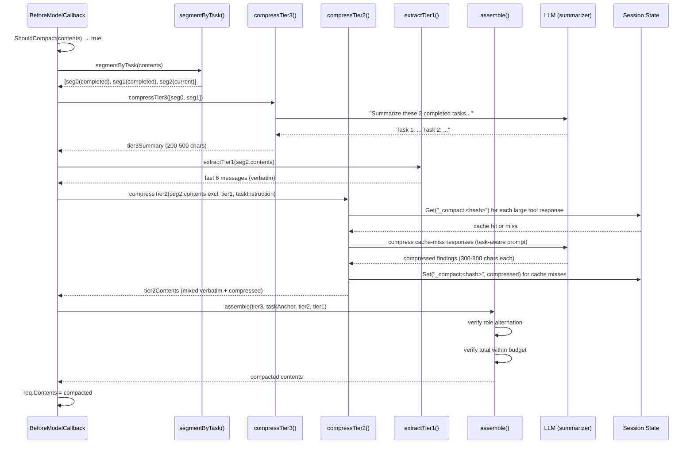

# Smart Tiered Compaction

## Overview

Smart Compaction replaces the monolithic "summarize everything old" approach with a **3-tier, LLM-powered, task-aware** compaction system. Each piece of conversation history is compressed to a level appropriate for its role in the session:

- **Tier 1 (Active Window):** Last 6 messages — verbatim, untouched.
- **Tier 2 (Current Task):** User instructions verbatim, model text verbatim, large tool responses LLM-compressed to findings-only.
- **Tier 3 (Historical Tasks):** Each completed task collapsed to 1-3 sentences via a single batched LLM call.

**Key properties:**
- Task-aware: compression prompts include the user's current task instruction, producing semantically relevant summaries
- Cached: compressed results stored in session state, surviving pod restarts and scaling across replicas
- Self-healing: cache misses trigger re-compression (cheap LLM calls with small inputs)
- Budget-aware: two-pass assembly with re-compression fallback if first pass exceeds budget

**Target audience:** Developers modifying `pkg/session/compaction.go` or debugging context loss in long sessions.

---

## Problem Analysis

### The Context Loss Loop

In session `4dff6355`, the following pattern repeats destructively:

```
Turn 1: User says "Let's move to Deployment"
Turn 2: Model calls delegate_tasks → 3 sub-agents → 53KB combined result
Turn 3: Compaction fires (estimated 546K tokens > 140K threshold)
Turn 4: Old compactor summarizes EVERYTHING into ~1K tokens:
         "CURRENT TASK: Deployment. PROGRESS: read some docs."
Turn 5: Model has no memory of what was read → re-delegates same research
Turn 6: GOTO Turn 2
```

### Why Monolithic Summarization Fails

The old `summarize()` function:
1. Flattens all old contents into a single text representation
2. Truncates tool responses to 500 chars each in the prompt
3. Asks the LLM to summarize into ~500-1000 tokens
4. Loses 95%+ of what was learned from delegate_tasks responses

This is architecturally wrong for tool-heavy sessions because:
- A 53KB delegate response contains specific findings (file paths, API behaviors, verified facts)
- A 500-char truncation for the summarizer input discards everything except the first few lines
- The resulting summary is generic ("read some docs") rather than specific ("astonish deploy doesn't exist, found in 3 doc pages, port flag only on studio command")

### The Amplification Effect

Each `delegate_tasks` call returns 16-53KB (5-18K tokens). With a 200K token context window and ~34K consumed by system prompt + tools, the usable budget is ~166K tokens. After just 2-3 delegate calls, the heuristic estimates exceed the 70% threshold (116K tokens), triggering compaction. Post-compaction, the model retains ~2-5K tokens total — virtually nothing.

### Token Math

```
Session 4dff6355 at compaction trigger:
  Total content:  1.6M chars / 3 chars/token = ~546K estimated tokens
  Context window: 200K tokens
  Threshold:      0.7 × 200K = 140K tokens
  Result:         546K >> 140K → compaction fires EVERY model call
  
After old compaction:
  Summary:        ~1K tokens
  Task anchor:    ~100 tokens  
  Recent (4 msg): ~2-4K tokens (all tool call/response pairs)
  Total retained: ~3-5K tokens (99% of knowledge destroyed)
```

---

## Architecture

### Three-Tier Model

```
┌─────────────────────────────────────────────────────────────────────────┐
│                                                                         │
│  ┌───────────────────────────────────────────────────────────────────┐  │
│  │  TIER 1: ACTIVE WINDOW (last 6 messages, verbatim)               │  │
│  │                                                                   │  │
│  │  Purpose: immediate working context for the model's next turn     │  │
│  │  Size: 3-8K tokens                                                │  │
│  │  Processing: none (tool-pair boundary adjustment only)            │  │
│  └───────────────────────────────────────────────────────────────────┘  │
│                                                                         │
│  ┌───────────────────────────────────────────────────────────────────┐  │
│  │  TIER 2: CURRENT TASK (all messages in active task segment)       │  │
│  │                                                                   │  │
│  │  User text:        verbatim (never compressed)                    │  │
│  │  Model reasoning:  verbatim (already small)                       │  │
│  │  Tool responses:                                                  │  │
│  │    < 3000 chars:   verbatim                                       │  │
│  │    ≥ 3000 chars:   LLM-compressed to 300-800 char findings        │  │
│  │                                                                   │  │
│  │  Purpose: model remembers what it already researched              │  │
│  │  Size: 1-4K tokens                                                │  │
│  └───────────────────────────────────────────────────────────────────┘  │
│                                                                         │
│  ┌───────────────────────────────────────────────────────────────────┐  │
│  │  TIER 3: COMPLETED TASKS (historical, fully done work)            │  │
│  │                                                                   │  │
│  │  Each completed task → 1-3 sentences via batched LLM call         │  │
│  │  Example: "Security: reviewed 5 pages, fixed CLI references,      │  │
│  │           authentication docs, credential-security redaction       │  │
│  │           layers. Committed cced039a."                             │  │
│  │                                                                   │  │
│  │  Purpose: model knows what happened before without noise          │  │
│  │  Size: 200-800 tokens                                             │  │
│  └───────────────────────────────────────────────────────────────────┘  │
│                                                                         │
└─────────────────────────────────────────────────────────────────────────┘
```

### Tier Characteristics

| Tier | Input | Processing | Output Size | LLM Calls | Cache |
|------|-------|-----------|-------------|-----------|-------|
| 1 | Last 6 messages | None (tool-pair boundary only) | 3-8K tokens | 0 | No |
| 2 | Current task segment (excl. tier 1) | User/model verbatim; tool responses ≥3K chars compressed | 1-4K tokens | 0-5 (cached) | Yes |
| 3 | All completed task segments | Batched summarization | 200-800 tokens | 1 | No (re-computed) |

### Data Flow



---

## Task Segmentation

### Concept

A "task" is a coherent unit of work initiated by a user instruction. The conversation is divided into sequential, non-overlapping task segments. The segmenter identifies boundaries by analyzing user messages.

### Segment Structure

```go
type taskSegment struct {
    StartIdx    int       // inclusive index in contents slice
    EndIdx      int       // exclusive
    Instruction string    // the user text that started this task
    Completed   bool      // true if model signaled completion AND new task follows
}
```

### New Task Detection Rules

A user message starts a new task segment if ALL of the following are true:

1. **Role is "user"** — model messages never start tasks
2. **Not a FunctionResponse** — tool results delivered as user-role messages are NOT task boundaries
3. **Contains meaningful text** — empty or whitespace-only messages are skipped
4. **Not an affirmation** — short acknowledgments don't start new tasks

#### Affirmation List

```go
var affirmations = []string{
    "continue", "go", "yes", "ok", "go ahead", "proceed",
    "looks good", "approved", "lgtm", "correct", "that's right",
    "do it", "ship it", "perfect", "great", "good", "fine",
    "yep", "yeah", "sure", "agreed", "right",
}
```

Matching is case-insensitive after trimming. A message matches if:
- Its entire text equals an affirmation, OR
- Its text starts with an affirmation followed by punctuation (`,`, `.`, `!`)

#### Refinement Detection

Short messages (< 150 chars) that occur within an active task where the model has NOT emitted a completion signal are treated as refinements, not new tasks. This handles patterns like:

```
User: "Let's move to Deployment"          ← new task
Model: [does work]
User: "verify source code, no guessing"   ← refinement (short, no prior completion)
Model: [continues same task]
```

### Completion Signal Detection

A task is marked "completed" when:
1. The model emits text containing a completion signal word/phrase
2. AND a new task instruction follows (the NEXT user message starts a new segment)

Both conditions must be met — a model saying "Done!" mid-task doesn't complete the segment if the user's next message is a refinement.

**Completion signal patterns** (case-insensitive, word-boundary matched):

```go
var completionSignals = []string{
    "done", "committed", "pushed", "completed", "finished",
    "deployed", "merged", "fixed", "resolved", "shipped",
    "all set", "that's it", "all done", "task complete",
}
```

### Edge Cases

| Scenario | Handling |
|----------|----------|
| First message in session | Always starts segment 0 |
| User sends only tool responses (no text) | No new segment; appended to current |
| Model says "Done!" but user sends refinement | Segment NOT marked complete |
| Multiple user messages with no model response between them | Each could start a new segment (text length + affirmation rules apply) |
| Session starts with model message (restored session) | Implicit segment 0 with empty instruction |

---

## Tier 3: Historical Task Compression

### Purpose

Convert completed tasks into minimal context that lets the model know what happened without occupying significant token budget.

### Approach

All completed task segments are batched into a SINGLE LLM call. This is efficient because:
- Completed tasks are frozen (their content never changes)
- The combined input is usually small (each task's instruction + a few key model responses)
- One call produces all tier 3 summaries

### Prompt Template

```
Summarize each completed task below into 1-3 sentences. For each task, state:
- What the user requested
- What was accomplished
- Key artifacts produced (commit hashes, file paths, deployments)

Keep each summary factual and specific. Do NOT use filler phrases.
Output format: one task per line, prefixed with "Task N: "

---

TASK 1 (instruction: "<user instruction>"):
<truncated conversation for this segment — max 2000 chars>

TASK 2 (instruction: "<user instruction>"):
<truncated conversation for this segment — max 2000 chars>

...
```

### Input Preparation

For each completed segment, the prompt includes:
- The user's task instruction (verbatim)
- Model text responses (truncated to 300 chars each)
- Tool call names (listed, not their full args/responses)
- Any commit hashes, file paths, or URLs mentioned in model text

Total input per task is capped at 2000 chars to keep the summarization call fast.

### Expected Output

```
Task 1: Reviewed 5 security documentation pages. Fixed CLI references (astonish mcp list doesn't exist), updated authentication docs, verified credential-security redaction layers. Committed cced039a.
Task 2: Implemented Helm subchart integration for OpenShell. Added NetworkPolicy, namespace config, pluggable mesh support via mesh.provider value. PR #266 merged.
```

### Caching Behavior

Tier 3 is NOT cached in session state because:
- Historical tasks are frozen, but the summarization is cheap (one call for all)
- The set of completed tasks changes each time a new task completes
- Re-computing on each compaction cycle is acceptable (~2-3s latency)

---

## Tier 2: Current Task Compression

### Purpose

Preserve the FINDINGS from the current task's tool interactions while removing the raw evidence (file contents, API responses, log output). The model should know WHAT it learned, not HOW it learned it.

### Content Classification

Within the current task segment (excluding tier 1 messages), each content item is classified:

| Content Type | Treatment |
|-------------|-----------|
| User text (instruction or refinement) | Always verbatim |
| Model text (reasoning, explanations) | Always verbatim |
| Model FunctionCall | Keep call name + brief args summary |
| User FunctionResponse (< 3000 chars) | Verbatim |
| User FunctionResponse (≥ 3000 chars) | LLM-compressed to 300-800 chars |

### Why 3000 Chars

- Below 3000 chars (~1000 tokens): keeping verbatim is cheaper than an LLM call
- Above 3000 chars: the response contains enough raw data that compression yields significant token savings
- Typical delegate_tasks response: 16-53K chars → compressed to 300-800 chars (95-99% reduction)
- Typical grep/read response < 2000 chars: kept as-is

### Task-Aware Compression Prompt

```
The user's current task: "<task instruction from segment>"

Extract ONLY the conclusions and findings from this tool response that are
relevant to the task above. Rules:
- Remove raw file contents, log output, and source code
- Remove verbose explanations of what was searched/read
- Keep: verified facts, specific values, what exists/doesn't exist, 
  decisions made, error conditions discovered, file paths that matter
- Be specific: "port 9393" not "a port", "astonish deploy doesn't exist" 
  not "some commands are missing"

Target: 300-800 characters. Be dense.

Tool response:
<full tool response text>
```

### Compression Example

**Input** (16KB delegate_tasks response):
```
[Sub-agent 'deployment-reviewer' completed in 45.2s, 12 tool calls]
Result: ## Deployment Documentation Review
### Page 1: Getting Started
I read the file at docs/deployment/getting-started.md...
[8KB of file contents and analysis]
### Page 2: Helm Values  
I examined charts/astonish/values.yaml...
[5KB of values analysis]
### Findings
- The `astonish deploy` command referenced in docs doesn't exist in the CLI
- Port flag (--port) is only on the `studio` subcommand, not `serve`
- Helm chart version in docs says 3.0.8 but latest is 3.0.10
```

**Output** (420 chars):
```
Deployment docs review: (1) `astonish deploy` command doesn't exist — 
referenced in getting-started.md and quickstart.md. (2) --port flag only 
on `studio` subcommand, docs incorrectly show it on `serve`. (3) Helm 
chart version in docs is 3.0.8, should be 3.0.10. (4) values.yaml 
structure is accurate. 3 pages reviewed, 2 have errors.
```

### FunctionCall Compression

Model FunctionCall parts are kept but simplified:
- Name: kept as-is
- Args: if total arg JSON > 500 chars, replace with a one-line summary
- Example: `delegate_tasks({tasks: [3 tasks: "deployment-reviewer", "auth-checker", "helm-validator"]})`

---

## Tier 1: Active Window

### Purpose

The most recent messages are the model's immediate working context. They must be preserved exactly as-is to maintain coherent tool call flows and in-progress reasoning.

### Size

Default: 6 messages (up from 4 in the old system). Rationale:
- A typical tool call cycle is 2 messages (FunctionCall + FunctionResponse)
- 6 messages = 3 complete tool cycles, enough for the model to see its recent work
- Still tiny relative to the budget (~3-8K tokens out of 166K usable)

### Tool-Pair Safety

The tier 1 boundary is adjusted using `adjustSplitForToolPairs()` (retained from the current implementation). This ensures the active window never starts with an orphaned FunctionResponse whose matching FunctionCall would be in tier 2.

Algorithm:
```go
// Walk backward from the split point while the item at split has a
// FunctionResponse. Include the preceding message (matching FunctionCall)
// in the active window. Safety cap: move back at most 8 positions.
func adjustSplitForToolPairs(contents []*genai.Content, splitIdx int) int
```

---

## Assembly

### Order

The final compacted contents are assembled as:

```
[1] Tier 3 summary (role: determined by what follows)
[2] Task anchor (role: "user") — the current task instruction
[3] Tier 2 compressed contents (mixed roles, natural order preserved)
[4] Tier 1 active window (verbatim, natural order)
```

### Role Alternation

Some LLM providers (OpenAI, Anthropic via Bedrock) reject consecutive same-role messages. The assembler ensures proper alternation:

1. Determine tier 3 summary role based on what follows (task anchor is "user", so summary gets "model")
2. If task anchor would create consecutive same-role with summary, merge task anchor text into summary content
3. Tier 2 contents preserve their original roles (they're reconstructed from real conversation order)
4. Tier 1 is verbatim (already valid from the original conversation)

### Budget Verification

After first-pass assembly:

```go
estimated := EstimateTokens(assembled)
if estimated > int(float64(c.ContextWindow) * c.Threshold) {
    // Still over budget — re-compress tier 2 with stricter targets
    tier2 = recompressTier2(tier2, targetChars: 150)
    // Re-assemble and check again
}
if stillOver {
    // Emergency: keep only tier 1 + task anchor (drop tier 2 and tier 3)
}
```

The two-pass approach handles edge cases where the current task has many tool responses that individually compress to 800 chars but collectively still exceed the budget.

---

## Compression Cache (Session State)

### Why Session State

The compression cache must be:
- **Persistent**: survives daemon restarts
- **Shared across replicas**: works in horizontal scaling (K8s)
- **Zero schema changes**: no DB migrations required

ADK's session state satisfies all three. State is persisted via `EventActions.StateDelta` in each event, stored in the `event_data` JSON blob, and replayed on session load from any replica.

### Cache Key Design

```go
func compressionCacheKey(text string) string {
    h := fnv.New64a()
    // Hash first 500 chars — sufficient for uniqueness (tool responses
    // have unique prefixes like "[Sub-agent 'name' completed...]")
    if len(text) > 500 {
        h.Write([]byte(text[:500]))
    } else {
        h.Write([]byte(text))
    }
    return fmt.Sprintf("_compact:%016x", h.Sum64())
}
```

**Properties:**
- FNV-64a: fast, good distribution, 64-bit collision resistance
- First 500 chars: tool responses have unique headers (agent name, duration, tool count)
- `_compact:` prefix: won't collide with application state keys (which use `app:`, `user:`, `temp:` prefixes)

### Cache Read/Write Flow

```go
// In compressTier2Content():
func (c *Compactor) compressToolResponse(ctx context.Context, state session.State, 
    responseText string, taskInstruction string) (string, error) {
    
    key := compressionCacheKey(responseText)
    
    // Check cache
    if cached, err := state.Get(key); err == nil {
        if s, ok := cached.(string); ok {
            return s, nil  // cache hit
        }
    }
    
    // Cache miss — compress via LLM
    compressed, err := c.LLM(ctx, buildTier2Prompt(responseText, taskInstruction))
    if err != nil {
        return responseText, err  // fallback: keep verbatim
    }
    
    // Store in cache
    _ = state.Set(key, compressed)  // best-effort; failure just means re-compress next time
    
    return compressed, nil
}
```

### Cache Lifecycle

| Event | Behavior |
|-------|----------|
| First compression of a tool response | Write to state via `Set()` |
| Subsequent compaction cycles | Read from state via `Get()` — cache hit |
| Pod restart | State replayed from DB on session load — cache available |
| New replica handles session | Same — state loaded from DB |
| Session state somehow lost | `Get()` returns error → treated as cache miss → re-compress |

### State Size Impact

Typical session with smart compaction:
- 5-10 cached compressions × 300-800 chars each = 2-8KB in state
- Session state already stores flow variables, plan state, etc. (~1-5KB typical)
- Total state < 15KB — negligible relative to the event_data JSON blobs (often 50-200KB each)

---

## Integration with ADK

### BeforeModelCallback Signature

The compactor's `BeforeModelCallback` receives `agent.CallbackContext` which provides:
- `ctx.State()` → `session.State` interface (Get/Set, persisted via StateDelta)
- Context (ctx is also a `context.Context` for cancellation)

```go
func (c *Compactor) BeforeModelCallback() llmagent.BeforeModelCallback {
    return func(ctx adkagent.CallbackContext, req *model.LLMRequest) (*model.LLMResponse, error) {
        if req == nil || len(req.Contents) == 0 {
            return nil, nil
        }
        if !c.ShouldCompact(req.Contents) {
            return nil, nil
        }
        
        compacted, err := c.CompactContents(ctx, req.Contents, ctx.State())
        if err != nil {
            return nil, nil  // proceed with original on failure
        }
        
        req.Contents = compacted
        return nil, nil
    }
}
```

### State Persistence Path

When `ctx.State().Set(key, val)` is called inside the BeforeModelCallback:

```
Set(key, val)
  → writes to callbackContext.actions.StateDelta[key] = val
  → also writes to session's in-memory state (immediate read-back)
  
After the model call completes:
  → ADK emits an Event with Actions.StateDelta containing our cache entries
  → Session store persists the event (including StateDelta) to DB
  → On next session load, state is rebuilt by replaying all StateDelta maps
```

This means the cache write is "fire and forget" — it will be persisted as part of the normal event flow without any extra DB calls.

---

## LLM Call Budget

### Per-Compaction Cycle

| Scenario | Tier 3 | Tier 2 | Total | Notes |
|----------|--------|--------|-------|-------|
| First compaction: 2 completed tasks, 3 large tool responses | 1 | 3 | **4** | All cache misses |
| Second compaction: same session, 1 new large response | 1 | 1 | **2** | 2 cache hits + 1 miss |
| Third compaction: no new responses (model reasoning only) | 1 | 0 | **1** | All cache hits |
| New task started: 1 new completed task, fresh current task | 1 | 0 | **1** | No tier 2 yet |
| Worst case: 0 completed tasks, 5 new large responses (no cache) | 0 | 5 | **5** | Rare — only on first compaction of a tool-heavy task |

### Cost Analysis

Each compression LLM call:
- Input: ~1-5K tokens (tool response + task instruction + prompt)
- Output: ~200-400 tokens (compressed finding)
- Latency: 1-3 seconds
- Cost: negligible (< $0.01 per call at typical LLM pricing)

Compared to the MAIN model call:
- Input: 100-166K tokens (full context)
- Output: 1-10K tokens
- Cost: $0.50-2.00 per call

The compression calls cost < 1% of the main model calls. Even 5 calls per compaction cycle is architecturally insignificant.

---

## Configuration

| Parameter | Field | Default | Description |
|-----------|-------|---------|-------------|
| Context window | `ContextWindow` | Provider-specific | Total token budget (set by launcher from provider config) |
| Compaction threshold | `Threshold` | 0.7 | Fraction of context window that triggers compaction |
| Active window size | `PreserveRecent` | 6 | Number of messages in tier 1 |
| Tier 2 compression threshold | `Tier2Threshold` | 3000 | Chars above which tool responses get LLM-compressed |
| Tier 2 target size | `Tier2TargetChars` | 800 | Target chars for tier 2 compression output |
| Tier 2 strict target | `Tier2StrictTarget` | 150 | Target chars for re-compression on budget overflow |
| Max tier 3 input per task | `Tier3MaxInputPerTask` | 2000 | Max chars of conversation included per task in tier 3 prompt |
| Tool-pair backtrack limit | (constant) | 8 | Max positions to walk back for tool-pair safety |

All parameters have sensible defaults. No configuration file changes required for deployment.

---

## Error Handling & Fallbacks

### Failure Modes

| Failure | Detection | Fallback | Rationale |
|---------|-----------|----------|-----------|
| LLM function is nil | `c.LLM == nil` | Truncation summary (legacy) | Preserves basic functionality for deployments without summarization LLM |
| Tier 3 LLM call fails | Error return from `c.LLM()` | Skip tier 3 entirely; current task + active window only | Historical context is nice-to-have, not critical |
| Tier 2 LLM call fails for one response | Error return from `c.LLM()` | Keep that response verbatim (no compression) | One large response is better than a gap |
| All tier 2 LLM calls fail | Multiple errors | Fall back to legacy summarize() for the whole old portion | Complete LLM failure means we can't do smart compaction |
| Cache read error | `state.Get()` returns error | Treat as cache miss, compress via LLM | Self-healing; the result gets cached for next time |
| Cache write error | `state.Set()` returns error | Ignore (compression still returned to caller) | Cache is optimization, not requirement |
| Budget exceeded after first pass | `EstimateTokens(assembled) > threshold` | Re-compress tier 2 with strict target (150 chars) | Second pass with tighter constraints |
| Budget exceeded after second pass | Still over after re-compression | Emergency: tier 1 + task anchor only (drop tier 2/3) | Last resort; preserves active window |

### Graceful Degradation Hierarchy

```
Smart compaction (LLM available, state available)
  │ LLM call fails for some responses
  ▼
Partial smart compaction (some responses verbatim, others compressed)
  │ ALL tier 2 LLM calls fail
  ▼
Legacy summarize() fallback (monolithic summary like old behavior)
  │ Legacy LLM call also fails
  ▼
Truncation summary (structural extraction, no LLM)
  │ Budget still exceeded
  ▼
Emergency: active window + task anchor only
```

The system never hard-fails. Each level of degradation loses quality but maintains session continuity.

---

## Detailed Algorithm

### CompactContents (entry point)

```go
func (c *Compactor) CompactContents(ctx context.Context, contents []*genai.Content, 
    state session.State) ([]*genai.Content, error) {
    
    // 1. Segment conversation into tasks
    segments := segmentByTask(contents)
    
    // 2. Identify completed vs current segments
    var completed []taskSegment
    var current taskSegment
    for i, seg := range segments {
        if i == len(segments)-1 {
            current = seg  // last segment is always "current"
        } else if seg.Completed {
            completed = append(completed, seg)
        } else {
            current = seg  // if last non-final segment is incomplete, merge with final
            // (edge case: only one segment)
        }
    }
    
    // 3. Extract tier 1 (active window from current segment)
    tier1Start := len(contents) - c.PreserveRecent
    tier1Start = adjustSplitForToolPairs(contents, tier1Start)
    tier1 := contents[tier1Start:]
    
    // 4. Compute tier 3 (completed tasks summary)
    var tier3Summary string
    if len(completed) > 0 {
        var err error
        tier3Summary, err = c.compressTier3(ctx, completed, contents)
        if err != nil {
            // Log and continue without tier 3
            slog.Warn("tier 3 compression failed", "error", err)
        }
    }
    
    // 5. Extract task anchor
    taskAnchor := findLastUserTextInstruction(contents[:tier1Start])
    taskInstruction := ""
    if taskAnchor != nil {
        taskInstruction = extractPlainText(taskAnchor)
    }
    
    // 6. Compute tier 2 (current task, compressed)
    tier2Contents := contents[current.StartIdx:tier1Start]
    tier2Compressed, err := c.compressTier2(ctx, state, tier2Contents, taskInstruction)
    if err != nil {
        // Fallback: legacy summarize for the old portion
        return c.legacyFallback(ctx, contents, tier1Start)
    }
    
    // 7. Assemble
    result := c.assemble(tier3Summary, taskAnchor, tier2Compressed, tier1)
    
    // 8. Budget check
    if EstimateTokens(result) > int(float64(c.ContextWindow)*c.Threshold) {
        // Re-compress with strict targets
        tier2Compressed, _ = c.compressTier2Strict(ctx, state, tier2Contents, taskInstruction)
        result = c.assemble(tier3Summary, taskAnchor, tier2Compressed, tier1)
    }
    if EstimateTokens(result) > int(float64(c.ContextWindow)*c.Threshold) {
        // Emergency: just tier 1 + anchor
        result = c.assembleEmergency(taskAnchor, tier1)
    }
    
    return result, nil
}
```

### segmentByTask

```go
func segmentByTask(contents []*genai.Content) []taskSegment {
    var segments []taskSegment
    currentStart := 0
    currentInstruction := ""
    
    for i, content := range contents {
        if isNewTaskBoundary(content, contents, i, currentInstruction) {
            // Close previous segment
            if i > currentStart || currentStart == 0 {
                segments = append(segments, taskSegment{
                    StartIdx:    currentStart,
                    EndIdx:      i,
                    Instruction: currentInstruction,
                })
            }
            // Start new segment
            currentStart = i
            currentInstruction = extractText(content)
        }
    }
    
    // Close final segment
    segments = append(segments, taskSegment{
        StartIdx:    currentStart,
        EndIdx:      len(contents),
        Instruction: currentInstruction,
    })
    
    // Mark completion status
    markCompletionStatus(segments, contents)
    
    return segments
}
```

### isNewTaskBoundary

```go
func isNewTaskBoundary(content *genai.Content, allContents []*genai.Content, 
    idx int, currentInstruction string) bool {
    
    if content == nil || content.Role != "user" {
        return false
    }
    if hasFunctionResponse(content) {
        return false
    }
    text := extractText(content)
    if text == "" {
        return false
    }
    if isAffirmation(text) {
        return false
    }
    // Refinement detection: short message + no completion signal from model
    if len(text) < 150 && currentInstruction != "" {
        if !hasCompletionSignalBetween(allContents, findLastSegmentStart(allContents, idx), idx) {
            return false  // refinement, not new task
        }
    }
    return true
}
```

---

## Prompts (Full Text)

### Tier 3 Batch Summarization Prompt

```
You are summarizing completed tasks from a conversation history.

For each task below, write 1-3 sentences stating:
1. What the user requested
2. What was accomplished (key actions taken)
3. Key artifacts (commit hashes, file paths modified, PRs, deployments)

Rules:
- Be specific and factual. Use exact names, paths, and hashes.
- Do NOT use filler ("The user asked me to..." — just state what was done).
- One task per paragraph, prefixed with "TASK N: "

---

TASK 1 (user said: "{instruction_1}"):
{truncated_conversation_1}

TASK 2 (user said: "{instruction_2}"):
{truncated_conversation_2}
```

### Tier 2 Tool Response Compression Prompt

```
The user's current task: "{task_instruction}"

Extract ONLY the conclusions and findings from this tool response that are relevant to the task above.

Rules:
- Remove raw file contents, log output, full API responses, and source code
- Remove descriptions of what was searched/read (the process)
- Keep: verified facts, specific values, what exists vs doesn't exist, 
  decisions made, error conditions found, important file paths, version numbers
- Be specific: "port 9393" not "a port", "astonish deploy doesn't exist" not "some commands missing"
- If the response contains multiple sub-results, preserve each key finding

Target length: {target_chars} characters. Be dense and precise.

---

Tool response ({response_length} chars):
{tool_response_text}
```

---

## Testing Strategy

### Unit Tests

| Test | What It Validates |
|------|-------------------|
| `TestSegmentByTask_Basic` | Simple 2-task conversation splits correctly |
| `TestSegmentByTask_Affirmations` | "continue", "go", "yes" don't start new segments |
| `TestSegmentByTask_Refinement` | Short follow-up within active task stays in same segment |
| `TestSegmentByTask_CompletionDetection` | Model "Done!" + new user message = completed segment |
| `TestSegmentByTask_SingleTask` | Session with only one task produces one segment |
| `TestSegmentByTask_NoUserText` | All-tool-response contents = one segment with empty instruction |
| `TestTier3Compression` | Completed tasks batched into one LLM call; output parsed correctly |
| `TestTier2CacheHit` | Cached compression returned without LLM call |
| `TestTier2CacheMiss` | LLM called for uncached response; result stored in state |
| `TestTier2SmallResponseVerbatim` | Responses < 3000 chars not compressed |
| `TestTier2TaskAwarePrompt` | Task instruction included in compression prompt |
| `TestAssemblyRoleAlternation` | No consecutive same-role messages in output |
| `TestAssemblyBudgetOverflow` | Re-compression triggered when first pass exceeds budget |
| `TestAssemblyEmergency` | Emergency fallback to tier1 + anchor when all else fails |
| `TestCacheKeyDeterminism` | Same input always produces same key |
| `TestCacheKeyUniqueness` | Different tool responses produce different keys |
| `TestFallbackOnLLMFailure` | LLM error → graceful degradation per hierarchy |

### Integration Tests

| Test | What It Validates |
|------|-------------------|
| `TestSmartCompaction_DelegateLoop` | Reproduces the session 4dff6355 pattern: delegate → compact → model should NOT re-delegate same work |
| `TestSmartCompaction_MultiTask` | 3-task session: first two fully compressed to tier 3, third has tier 2 compression |
| `TestSmartCompaction_WithRealState` | Full round-trip with ADK session state persistence and cache read-back |

### Regression Tests

| Test | Defends Against |
|------|----------------|
| `TestToolPairSafety` | (existing) Orphaned FunctionResponse at tier 1 boundary |
| `TestTaskAnchorSurvives` | (existing) Current task instruction preserved through compaction |
| `TestNoRepeatedDelegation` | Model doesn't re-research after compaction preserves findings |

---

## Migration Notes

### No Breaking Changes

- **No schema changes**: session state is the storage mechanism (already JSON)
- **No config file changes**: all new parameters have defaults
- **No API changes**: compaction is internal to the BeforeModelCallback
- **No behavior change for short sessions**: compaction only fires when threshold is exceeded

### Code Changes

| File | Change |
|------|--------|
| `pkg/session/compaction.go` | Rewrite `CompactContents()`, add tier functions, add segmenter |
| `pkg/session/compaction_test.go` | Add all tests listed above |
| `pkg/session/compaction.go` | `BeforeModelCallback()` updated to pass `ctx.State()` |

### Retained Code

| Function | Status |
|----------|--------|
| `adjustSplitForToolPairs()` | Retained (tier 1 boundary) |
| `hasFunctionResponse()` / `hasFunctionCall()` | Retained (used in segmenter and tier 1) |
| `findLastUserTextInstruction()` | Retained (task anchor extraction) |
| `EstimateTokens()` | Retained (budget calculation) |
| `ShouldCompact()` | Retained (trigger logic) |
| `ForceNextCompaction()` | Retained (400-retry support) |
| `truncateText()` | Retained (utility) |
| `truncationSummary()` | Retained (emergency fallback) |

### Removed Code

| Function | Reason |
|----------|--------|
| `summarize()` (old) | Replaced by tiered compression |

---

## Key Invariants

1. **User text instructions are NEVER compressed** — always verbatim in tier 2 or as task anchor
2. **The active window (tier 1) is NEVER modified** — last 6 messages exactly as-is
3. **Tool-pair safety is maintained** at the tier 1 boundary via `adjustSplitForToolPairs()`
4. **Role alternation is enforced** in the final assembly — no consecutive same-role messages
5. **Cached compressions are immutable** — same input always produces same cache key; once cached, never re-compressed with different parameters (strict re-compression uses a different key suffix)
6. **Session state keys use `_compact:` prefix** — guaranteed no collision with ADK's `app:`, `user:`, `temp:` prefixes or application state keys
7. **LLM failure never crashes compaction** — every LLM call has a fallback (verbatim, skip, or legacy)
8. **Compaction is idempotent** — running it twice on already-compacted content is safe (the summary message won't match segmentation criteria and will be treated as a single-segment current task)

---

## Comparison: Before vs After

### Before (Monolithic Summarization)

```
Input: 150K tokens of conversation
  ↓
[summarize()] — one LLM call with 30K char truncated input
  ↓
Output: ~1K token summary + 4 recent messages (~3-5K tokens total)

Knowledge retained: ~2% (generic task description only)
Model behavior: re-researches everything after compaction
LLM calls: 1
```

### After (Smart Tiered Compaction)

```
Input: 150K tokens of conversation
  ↓
[segmentByTask()] → 3 segments (2 completed, 1 current)
  ↓
[compressTier3()] — 1 LLM call for completed tasks → 400 tokens
[compressTier2()] — 3 LLM calls for large tool responses → 1200 tokens
[extractTier1()] — 6 messages verbatim → 5000 tokens
  ↓
Output: 400 + 100 (anchor) + 1200 + 5000 = ~6700 tokens

Knowledge retained: ~85% of findings, 100% of current task context
Model behavior: continues from where it left off
LLM calls: 4 (first time), 1-2 (subsequent, cached)
```

### Token Budget Utilization

```
Context window:    200K tokens
System + tools:     34K tokens
Usable budget:     166K tokens
After compaction:   ~7K tokens retained
Headroom:          159K tokens (for model reasoning + new tool calls)

→ Model has MASSIVE headroom while retaining all important findings
```
