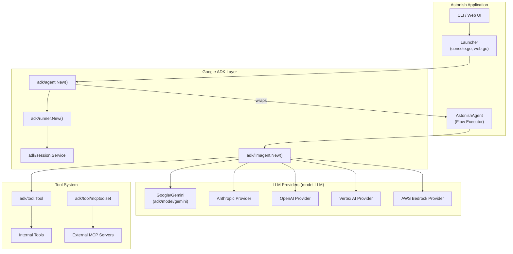
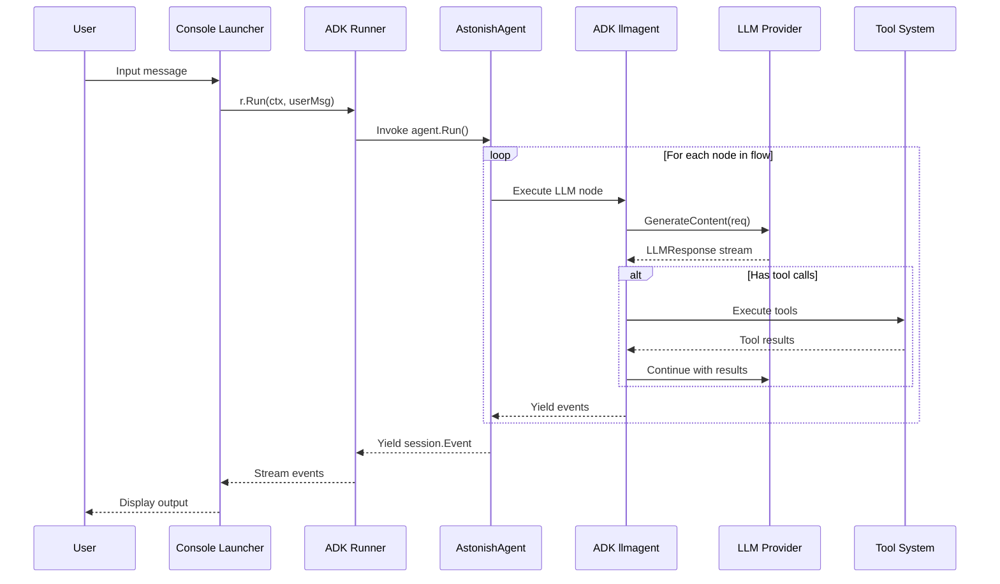
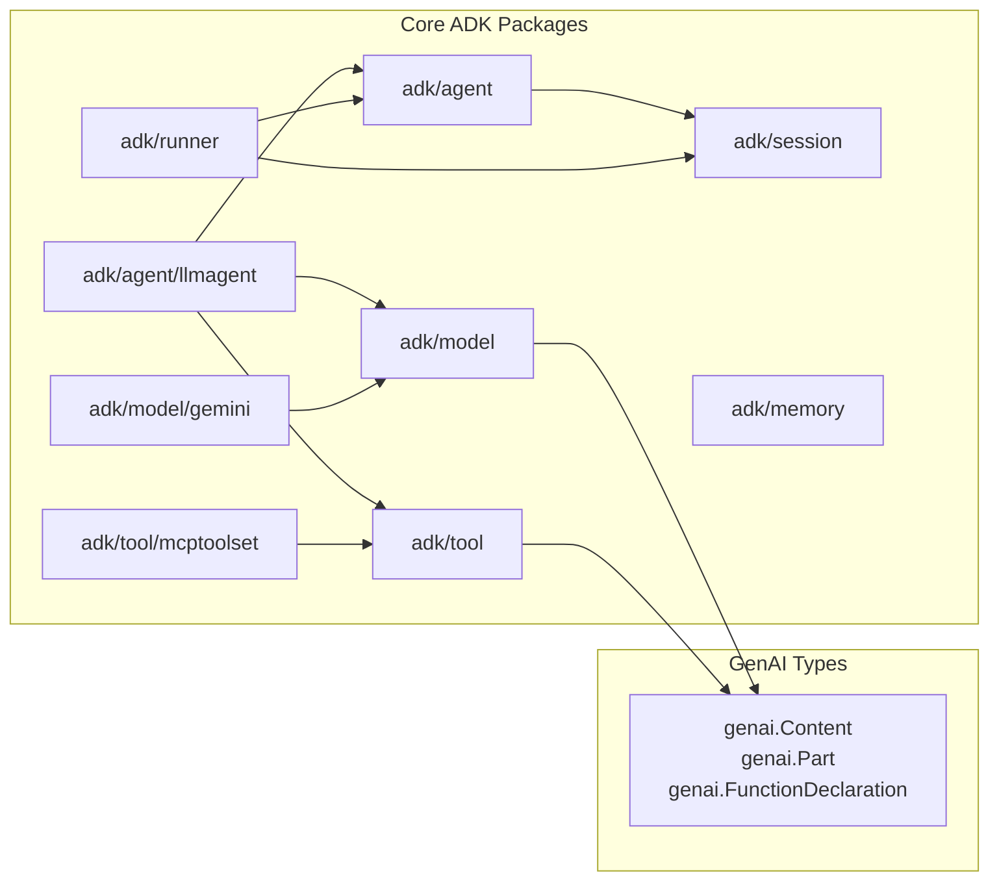

# Google ADK Integration in Astonish

This document explains how the Google Agent Development Kit (ADK) is used in the Astonish project, its role, architecture, and the benefits it provides.

## What is Google ADK?

**Google ADK (Agent Development Kit)** is Google's Go framework for building AI agents. It provides:

- **Agent Framework**: Core abstractions for building agentic AI applications
- **LLM Abstraction**: Unified interface (`model.LLM`) for multiple LLM providers
- **Session Management**: Stateful conversation handling with persistence
- **Tool Integration**: Native support for function calling and MCP (Model Context Protocol)
- **Runner System**: Execution engine for running agent flows

Astonish uses **ADK v0.2.0** (`google.golang.org/adk`) as its foundational framework.

---

## Architecture Overview



---

## Key ADK Components Used

### 1. Agent Framework (`google.golang.org/adk/agent`)

The `agent` package provides the core abstractions for building agents.

```go
// From pkg/launcher/console.go
import adkagent "google.golang.org/adk/agent"

// Create ADK agent wrapper around AstonishAgent
adkAgent, err := adkagent.New(adkagent.Config{
    Name:        "astonish_agent",
    Description: cfg.AgentConfig.Description,
    Run:         astonishAgent.Run,  // Custom flow execution
})
```

**Benefits**:
- Standard agent lifecycle management
- Event-driven execution model with `iter.Seq2` pattern
- Context-aware invocation handling

---

### 2. LLM Agent (`google.golang.org/adk/agent/llmagent`)

The `llmagent` package handles LLM interactions with native function calling.

```go
// From pkg/agent/astonish_agent.go
import "google.golang.org/adk/agent/llmagent"

// Create ADK llmagent for this node
llmAgent, err := llmagent.New(llmagent.Config{
    Model:          a.LLM,
    Instruction:    instruction,
    Tools:          internalTools,
    Toolsets:       mcpToolsets,
    OutputSchema:   outputSchema,
})
```

**Benefits**:
- Handles function calling loop automatically
- Manages conversation history
- Supports structured output schemas
- Provides before/after tool callbacks for approval workflows

---

### 3. Runner (`google.golang.org/adk/runner`)

The `runner` package provides the execution engine.

```go
// From pkg/launcher/console.go
import "google.golang.org/adk/runner"

r, err := runner.New(runner.Config{
    AppName:        appName,
    Agent:          adkAgent,
    SessionService: sessionService,
})

// Execute agent
for event, err := range r.Run(ctx, userID, sess.ID, userMsg, runConfig) {
    // Process streaming events
}
```

**Benefits**:
- Manages execution lifecycle
- Handles streaming responses
- Integrates with session management
- Provides SSE streaming mode for real-time output

---

### 4. Session Management (`google.golang.org/adk/session`)

The `session` package handles stateful conversations.

```go
// From pkg/launcher/console.go
import "google.golang.org/adk/session"

sessionService := session.InMemoryService()

resp, err := sessionService.Create(ctx, &session.CreateRequest{
    AppName: appName,
    UserID:  userID,
})

// Access session state
state := ctx.Session().State()
state.Set("current_node", nodeName)
value, _ := state.Get("user_input")
```

**Benefits**:
- Persistent state across turns
- Event history tracking
- State delta propagation
- Multi-user support

---

### 5. Tool System (`google.golang.org/adk/tool`)

The tool system enables function calling.

```go
// From pkg/tools/internal.go
import (
    "google.golang.org/adk/tool"
    "google.golang.org/adk/tool/functiontool"
)

// Create internal tools using ADK's functiontool
tool := functiontool.Must(myFunction, &functiontool.Config{
    Declaration: &genai.FunctionDeclaration{
        Name:        "my_tool",
        Description: "Does something useful",
    },
})
```

**Benefits**:
- Type-safe tool definitions
- Automatic JSON schema generation
- Integration with LLM function calling

---

### 6. MCP Toolset (`google.golang.org/adk/tool/mcptoolset`)

Enables integration with external MCP servers.

```go
// From pkg/mcp/manager.go
import "google.golang.org/adk/tool/mcptoolset"

toolset, err := mcptoolset.New(mcptoolset.Config{
    Transport: transport,
})
```

**Benefits**:
- Automatic tool discovery from MCP servers
- Transparent tool execution
- Supports stdio and SSE transports
- No manual tool registration needed

---

### 7. Model Interface (`google.golang.org/adk/model`)

Unified LLM interface for multi-provider support.

```go
// From pkg/provider/anthropic/anthropic.go
import "google.golang.org/adk/model"

// All providers implement model.LLM
type Provider struct {
    // ...
}

func (p *Provider) Name() string { ... }
func (p *Provider) GenerateContent(
    ctx context.Context, 
    req *model.LLMRequest, 
    stream bool,
) iter.Seq2[*model.LLMResponse, error] { ... }
```

**Benefits**:
- Single interface for all LLM providers
- Consistent request/response format using `genai.Content`
- Streaming support built-in
- Tool calling abstraction

---

## Data Flow Diagram



---

## Benefits of Using ADK

### 1. **Provider Abstraction**
Write once, run with any LLM. Astonish supports:
- Google Gemini (native via `adk/model/gemini`)
- Anthropic Claude
- OpenAI GPT
- AWS Bedrock (Claude, Titan)
- Google Vertex AI

### 2. **Built-in Tool Calling**
ADK handles the function calling loop:
- Sends tool definitions to LLM
- Parses tool call responses
- Executes tools
- Feeds results back to LLM
- Repeats until completion

### 3. **MCP Integration**
First-class support for Model Context Protocol:
- Automatic tool discovery
- Transparent execution
- No custom protocol handling needed

### 4. **Session State Management**
Persistent state across conversation turns:
- Tracks flow position
- Stores node outputs
- Manages approval states
- Handles multi-turn workflows

### 5. **Streaming Architecture**
Real-time response streaming using Go's iterator pattern:
```go
for event, err := range agent.Run(ctx) {
    // Process events as they arrive
}
```

### 6. **Structured Output**
Native support for JSON schema responses:
```go
llmagent.New(llmagent.Config{
    OutputSchema: &genai.Schema{
        Type:       genai.TypeObject,
        Properties: map[string]*genai.Schema{...},
    },
})
```

---

## File Structure

Key files using ADK:

| File | ADK Usage |
|------|-----------|
| [pkg/launcher/console.go](file:///Users/I851355/Projects/astonish/pkg/launcher/console.go) | Agent creation, Runner, Session |
| [pkg/agent/astonish_agent.go](file:///Users/I851355/Projects/astonish/pkg/agent/astonish_agent.go) | llmagent, tool.Tool, session.State |
| [pkg/mcp/manager.go](file:///Users/I851355/Projects/astonish/pkg/mcp/manager.go) | mcptoolset for MCP integration |
| [pkg/provider/google/google.go](file:///Users/I851355/Projects/astonish/pkg/provider/google/google.go) | Native Gemini via adk/model/gemini |
| [pkg/provider/anthropic/anthropic.go](file:///Users/I851355/Projects/astonish/pkg/provider/anthropic/anthropic.go) | Implements model.LLM interface |
| [pkg/planner/react.go](file:///Users/I851355/Projects/astonish/pkg/planner/react.go) | ReAct fallback using ADK types |
| [pkg/tools/internal.go](file:///Users/I851355/Projects/astonish/pkg/tools/internal.go) | Tool definitions using functiontool |

---

## ADK Package Dependencies



---

## Summary

Google ADK serves as the **foundational framework** for Astonish, providing:

| Capability | ADK Component | Benefit |
|------------|---------------|---------|
| Agent Execution | `agent`, `runner` | Standardized lifecycle |
| LLM Integration | `model.LLM`, `llmagent` | Multi-provider support |
| State Management | `session.Service` | Persistent workflows |
| Tool Calling | `tool.Tool`, `mcptoolset` | Native function calling + MCP |
| Structured Output | `genai.Schema` | Type-safe responses |

By leveraging ADK, Astonish focuses on its unique value—**visual flow design**—while relying on production-grade infrastructure for agent execution.
