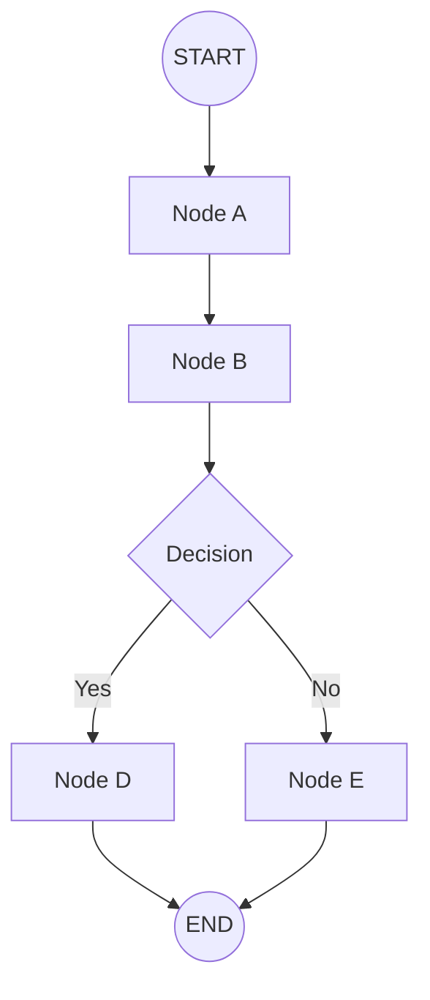

# Agent Flows

In Astonish, an **agent** is defined as a **flow**—a directed graph of nodes connected by edges. Each flow has a clear path from `START` to `END`, with processing happening at each node along the way.

## The Flow Model



### Key Concepts

| Concept | Description |
|---------|-------------|
| **START** | Every flow begins here. The entry point. |
| **END** | Every flow ends here. Multiple paths can lead to END. |
| **Node** | A processing step: LLM call, tool execution, user input, etc. |
| **Edge** | A connection from one node to another. |
| **State** | Data passed between nodes (the "blackboard"). |

## Types of Flows

### Sequential Flow

The simplest pattern—one node after another:

```yaml
flow:
  - from: START
    to: analyze
  - from: analyze
    to: summarize
  - from: summarize
    to: END
```

### Conditional Flow

Branch based on conditions:

```yaml
flow:
  - from: START
    to: check_input
  - from: check_input
    to: process_text
    condition: input_type == "text"
  - from: check_input
    to: process_code
    condition: input_type == "code"
  - from: process_text
    to: END
  - from: process_code
    to: END
```

### Looping Flow

Iterate until a condition is met:

```yaml
flow:
  - from: START
    to: attempt_task
  - from: attempt_task
    to: verify_result
  - from: verify_result
    to: END
    condition: is_valid
  - from: verify_result
    to: attempt_task
    condition: "!is_valid"
```

## State Blackboard

Nodes communicate through a shared state object called the **Blackboard**. When a node produces output, it writes to the blackboard. Subsequent nodes can read from it.

```yaml
nodes:
  - name: fetch_data
    type: llm
    prompt: "Fetch the weather for {city}"
    output_model:
      weather: str  # Writes to blackboard

  - name: summarize
    type: llm
    prompt: "Summarize this weather: {weather}"  # Reads from blackboard
```

## Visual Design

In **Astonish Studio**, you can:

- Drag nodes onto the canvas
- Connect them by dragging from output handles to input handles
- Configure each node's properties
- Run and debug in real-time

The visual design and the YAML are always in sync—what you see is what runs.
