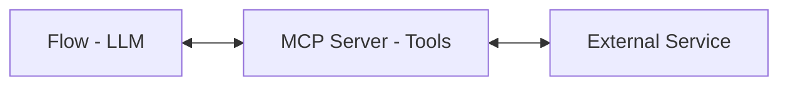

# MCP (Model Context Protocol)

**MCP** is an open standard that connects AI models to external tools. Astonish uses MCP to extend your flows with capabilities like web search, GitHub integration, and more.

## What is MCP?

MCP defines how AI assistants can:
- Discover available tools
- Call tools with parameters
- Receive tool results

Learn more: [modelcontextprotocol.io](https://modelcontextprotocol.io/)

## MCP in Astonish



1. Your flow calls an LLM with tools enabled
2. The LLM decides to use a tool
3. Astonish calls the MCP server
4. The tool executes and returns results
5. Results go back to the LLM

## MCP Servers

MCP servers provide tools:

| Server | Tools Provided |
|--------|---------------|
| GitHub | `create_issue`, `read_pull_request`, `list_repos` |
| Tavily | `web_search`, `web_extract` |
| Filesystem | `read_file`, `write_file`, `list_directory` |
| Python | `run_python` |

## Tool Configuration

Servers are defined in `mcp_config.json`:

```json
{
  "mcpServers": {
    "tavily": {
      "command": "npx",
      "args": ["-y", "tavily-mcp@latest"],
      "env": {
        "TAVILY_API_KEY": "tvly-xxx"
      },
      "transport": "stdio"
    }
  }
}
```

### Properties

| Property | Description |
|----------|-------------|
| `command` | Executable to run |
| `args` | Command arguments |
| `env` | Environment variables |
| `transport` | `stdio` (standard) or `sse` (streaming) |

## MCP Server Sources

MCP servers can come from three sources:

| Source | Description |
|--------|-------------|
| **Official MCP Store** | Built-in server store (`astonish tools store`) |
| **Tap Store** | Defined in a tap's `manifest.yaml` |
| **Inline** | Manually configured or embedded in flows |

When you use an MCP server in a flow, Astonish tracks its source and embeds this in the flow YAML. This ensures shared flows include the information needed to install dependencies.

## Using Tools in Flows

### Enable Tools

```yaml
- name: research
  type: llm
  prompt: "Find information about {topic}"
  tools: true
```

The LLM can now call any available tool.

### Whitelist Tools

Restrict to specific tools:

```yaml
- name: research
  type: llm
  prompt: "Find information about {topic}"
  tools: true
  tools_selection:
    - web_search
    - web_extract
```

### Direct Tool Calls

Call tools without AI reasoning:

```yaml
- name: search
  type: tool
  tools_selection:
    - web_search
```

## Listing Tools

See available tools:

```bash
astonish tools list
```

Output:
```
INTERNAL TOOLS (5)
  - web_search
  - web_extract
  ...

MCP SERVERS (2)
  github (4 tools)
    - create_issue
    - read_pull_request
    - create_comment
    - list_repositories
  
  tavily (2 tools)
    - web_search
    - web_extract
```

## Internal vs External Tools

| Type | Source | Examples |
|------|--------|----------|
| Internal | Built into Astonish | shell_command, read_file, write_file |
| External | MCP servers | GitHub, Tavily, filesystem, custom |

## Tool Flow

When an LLM calls a tool:

1. **LLM chooses tool** — Based on the prompt and available tools
2. **Astonish executes** — Runs the tool via MCP
3. **Results returned** — Tool output goes back to LLM
4. **LLM continues** — Uses results to complete the task

This can happen multiple times in a single node.

## Managing MCP Servers

```bash
# List installed servers
astonish tools list

# Edit configuration
astonish tools edit

# Browse server store
astonish tools store list

# Install a server
astonish tools store install github-mcp-server
```

## Best Practices

1. **Whitelist tools** — Limit to what's needed
2. **Provide context** — Tell the LLM what tools to prefer
3. **Check permissions** — Ensure API keys have required access
4. **Monitor usage** — Some tools have rate limits

## Next Steps

- **[Add MCP Servers](/using-the-app/add-mcp-servers/)** — Configure tools
- **[Nodes](/concepts/nodes/)** — Using tools in nodes
- **[YAML Reference](/concepts/yaml/)** — Tool syntax
