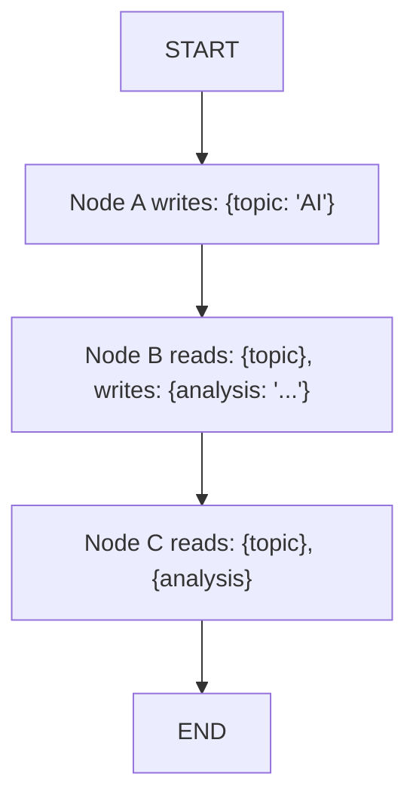

# State

**State** is how data flows between nodes. It's a shared object that nodes read from and write to.

## How State Works



Each node can:
- **Read** any existing state variables
- **Write** new variables or overwrite existing ones

## Setting State

### Via Input Nodes

User responses are stored in `output_model`:

```yaml
- name: ask_topic
  type: input
  prompt: "What should I analyze?"
  output_model:
    topic: str
```

After execution: `{topic: "user's answer"}`

### Via LLM Nodes

AI responses are stored:

```yaml
- name: analyze
  type: llm
  prompt: "Analyze {topic}"
  output_model:
    summary: str
    sentiment: str
```

After execution: `{topic: "AI", summary: "...", sentiment: "positive"}`

### Via Update State Nodes

Direct assignment:

```yaml
- name: initialize
  type: update_state
  updates:
    counter: "0"
    status: "ready"
```

### Via Parameters

Runtime parameters become initial state:

```bash
astonish flows run my_flow -p topic="AI" -p lang="en"
```

Initial state: `{topic: "AI", lang: "en"}`

## Reading State

Use `{variable}` syntax in prompts:

```yaml
- name: process
  type: llm
  prompt: "Analyze {topic} in {lang}"
```

Astonish replaces `{topic}` and `{lang}` with their values.

## State Types

### Output Model Types

```yaml
output_model:
  name: str       # String
  count: int      # Integer
  score: float    # Decimal
  enabled: bool   # Boolean
  items: list     # Array
  data: dict      # Object
```

### Type Examples

```yaml
output_model:
  title: str          # "My Title"
  word_count: int     # 150
  confidence: float   # 0.95
  is_valid: bool      # true
  tags: list          # ["ai", "ml"]
  metadata: dict      # {"author": "John"}
```

## State Scope

State is:
- **Flow-scoped** — Exists only during execution
- **Not persisted** — Gone when flow ends
- **Shared** — All nodes access the same state

## Common Patterns

### Chaining Outputs

```yaml
nodes:
  - name: analyze
    type: llm
    prompt: "Analyze {input}"
    output_model:
      analysis: str

  - name: summarize
    type: llm
    prompt: "Summarize this analysis: {analysis}"
    output_model:
      summary: str
```

### Conditional Branching

```yaml
nodes:
  - name: check
    type: llm
    prompt: "Is this valid? Answer yes or no."
    output_model:
      decision: str

flow:
  - from: check
    edges:
      - to: approve
        condition: "lambda x: x['decision'] == 'yes'"
      - to: reject
        condition: "lambda x: x['decision'] == 'no'"
```

### Accumulating Data

```yaml
nodes:
  - name: step1
    type: llm
    output_model:
      result1: str

  - name: step2
    type: llm
    prompt: "Based on {result1}, continue..."
    output_model:
      result2: str

  - name: combine
    type: llm
    prompt: "Combine {result1} and {result2}"
```

### Loops with Counters

Use `increment` to track iterations:

```yaml
nodes:
  - name: init
    type: update_state
    updates:
      attempts: "0"

  - name: attempt
    type: llm
    prompt: "Try to solve {problem}"
    output_model:
      result: str
    
  - name: increment
    type: update_state
    action: increment
    value: 1
    output_model:
      attempts: int

flow:
  - from: START
    to: init
  - from: init
    to: attempt
  - from: attempt
    to: increment
  - from: increment
    edges:
      - to: END
        condition: "lambda x: x.get('attempts', 0) >= 3"
      - to: attempt
        condition: "lambda x: x.get('attempts', 0) < 3"
```

### Alternative: Loops with Accumulation

Use `append` to track results and count by list length:

```yaml
- name: track_attempt
  type: update_state
  source_variable: result
  action: append
  output_model:
    attempts: list

# Then check: lambda x: len(x.get('attempts', [])) >= 3
```

## Debugging State

Enable debug mode to see state:

```bash
astonish flows run --debug my_flow
```

Output includes:
```
[State] {
  "topic": "AI",
  "analysis": "...",
  "summary": "..."
}
```

## Best Practices

1. **Use descriptive names** — `user_question` not `q`
2. **Document expected types** — In your flow description
3. **Initialize defaults** — Use update_state for setup
4. **Check before use** — Variables may not exist

## Next Steps

- **[Nodes](/concepts/nodes/)** — How nodes produce state
- **[YAML Reference](/concepts/yaml/)** — Complete syntax
