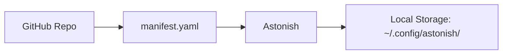

# Taps

**Taps** are extension repositories that provide flows and MCP server configurations. They're like package registries for Astonish content.

## What is a Tap?

A tap is a GitHub repository containing:
- **Flows** — Ready-to-use AI workflows
- **MCP Configs** — Pre-configured tool integrations (defined inline in manifest)
- **Manifest** — Index of available content

```
my-tap/
├── manifest.yaml       # Index of flows + inline MCP configs
├── README.md
└── flows/              # Flow YAML files
    ├── summarizer.yaml
    └── analyzer.yaml
```

## How Taps Work



1. You add a tap via Studio or CLI
2. Astonish fetches the manifest
3. You browse and install flows from the Flow Store
4. Installed flows appear in your flow list

## The Official Tap

Maintained by the Astonish team:

```bash
astonish tap add schardosin
```

Repository: `schardosin/astonish-flows`

## MCP Servers in Taps

MCP servers are defined **inline** in the `manifest.yaml`:

```yaml
name: my-flows
description: My collection of flows

flows:
  summarizer:
    description: Summarizes long text
    tags: [text, summary]

mcps:
  tavily:
    description: Web search capability
    command: npx
    args:
      - -y
      - tavily-mcp@0.1.2
    env:
      TAVILY_API_KEY: ""
    tags: [web-search]
```

When you install a flow that requires an MCP server, Astonish detects the dependency and offers one-click installation.

## Tap Storage

| Location | Purpose |
|----------|---------|
| `~/.config/astonish/store.json` | Configured tap list |
| `~/.config/astonish/store/<tap>/` | Cached manifests |
| `~/.config/astonish/flows/` | Your local flows |

## Private Taps

For team use with private repositories:

```bash
export GITHUB_TOKEN="ghp_xxx"
# or for enterprise:
export GITHUB_ENTERPRISE_TOKEN="ghp_xxx"
```

## Next Steps

- **[Manage Taps](/using-the-app/manage-taps/)** — UI and CLI guide for managing taps
- **[Share Your Flows](/using-the-app/share-flows/)** — Create your own tap
