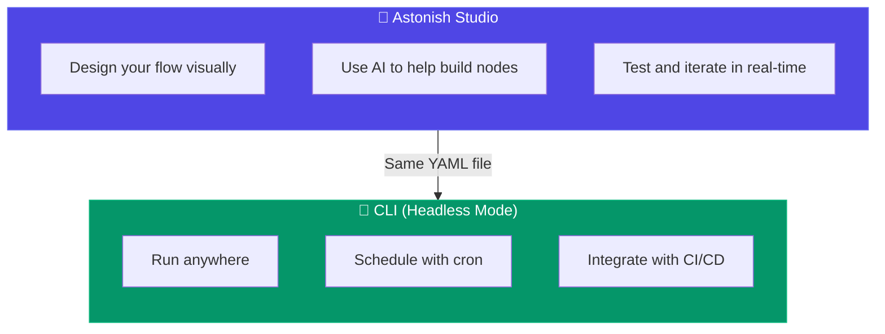

# The Astonish Workflow

Astonish is designed around a simple but powerful workflow: **build in the Studio, run anywhere with the CLI**.

## The Recommended Approach



### 🎨 Build in the Studio

Use **Astonish Studio** to design your flows. This is where you leverage:

- **Visual canvas** — Drag, drop, and connect nodes to build your logic
- **AI assistance** — Let AI help generate and refine your flows
- **Real-time testing** — Run and debug flows instantly
- **Form-based configuration** — No need to remember YAML syntax

```bash
# Launch the Studio
astonish studio
```


*Design your flows visually with AI assistance*

### 🚀 Run Anywhere with CLI

Once your flow is ready, run it anywhere using **headless mode**. The CLI gives you:

- **Zero dependencies** — Same single binary, no UI overhead
- **Full capabilities** — Every feature works in headless mode
- **Automation ready** — Scripts, cron jobs, CI/CD pipelines
- **Portable** — Containers, servers, Raspberry Pi, anywhere

```bash
# Run a flow
astonish flows run my_agent

# Pass parameters
astonish flows run my_agent -p input="Hello world"

# Schedule with cron
0 9 * * * astonish flows run daily_report >> /var/log/report.log
```

## Why This Workflow?

| Approach | Experience |
|----------|------------|
| **Studio only** | Great for building, but limited for automation |
| **CLI only** | Possible, but you lose visual design and AI assist |
| **Studio + CLI** | Best of both — visual power for building, CLI flexibility for running |

The Studio creates standard YAML files. These same files run identically in headless mode — no conversion, no export, no differences.

## Can I Skip the Studio?

Technically, yes. You can write YAML files by hand and run them directly with the CLI:

```bash
# Create a flow manually
cat > my-flow.yaml << 'EOF'
name: my-flow
nodes:
  - name: greet
    type: llm
    prompt: "Say hello"
flow:
  - from: START
    to: greet
  - from: greet
    to: END
EOF

# Import it
astonish flows import my-flow.yaml

# Run it
astonish flows run my-flow
```

But this is **not recommended**. You'll miss out on:
- Visual feedback of how your flow connects
- AI assistance for building nodes
- Real-time testing and debugging
- Easier configuration through forms

Start with the Studio, even for simple flows.

## Ready to Start?

**[→ Continue to Quickstart](/getting-started/quickstart/studio/)** — Build your first flow in 5 minutes
