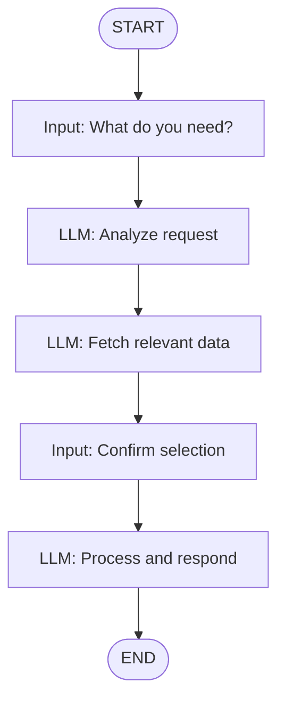

# Creating Flows

This guide covers everything about creating and organizing flows in Astonish Studio.

## Creating a New Flow

### Method 1: Sidebar Button

1. Click **+ New Flow** in the sidebar
2. Enter a name (e.g., `my_analyzer`)
3. Click **Create**


*The new flow dialog*

## Naming Conventions

Use descriptive names with spaces when creating flows:

```
Hello World
GitHub PR Reviewer
Daily Report Generator
```

Astonish automatically converts your flow name to a file-safe format:

| You enter | Saved as | CLI command |
|-----------|----------|-------------|
| `Hello World` | `hello_world.yaml` | `astonish flows run hello_world` |
| `GitHub PR Reviewer` | `github_pr_reviewer.yaml` | `astonish flows run github_pr_reviewer` |

## The Empty Canvas

Every new flow starts with two nodes:

- **START** — Where execution begins
- **END** — Where execution completes

These are system nodes that cannot be deleted.

```
START ─────────────────────────── END
         (your nodes go here)
```

## Adding Your First Node

1. Click the **+** button on the **START** node
2. A node type menu appears
3. Select a node type (e.g., **LLM**)
4. The new node is automatically connected to START


*Selecting a node type*

### Available Node Types

| Type | Purpose |
|------|---------|
| **Input** | Capture user input and save it to state |
| **LLM** | Call an AI model with tools and display messages |
| **Tool** | Execute an MCP tool directly without AI inference |
| **State** | Modify state variables (e.g., append to a list) |
| **Output** | Display a message from state to the user |

### Core Nodes: Input and LLM

**Input** and **LLM** are the nodes you'll use most often:

- **Input** — Prompts the user for information and saves it to state
- **LLM** — The most versatile node. It can call AI models, use tools, and display messages to users. In most cases, the LLM node handles everything you need.

### When to Use Other Nodes

- **Tool** — Execute an MCP tool directly without AI inference. Useful when you know exactly which tool to call and want to save tokens.
- **State** — Modify variables directly, like appending items to a list. Great for aggregating data across multiple steps.
- **Output** — Display a message to the user from a state variable. Useful when you want to show results from earlier steps at a different point in the flow.

## Connecting Nodes

When you add a node using the **+** button, it's automatically connected. To create additional connections:

1. Hover over a node's output handle (bottom edge)
2. Click and drag to another node's input handle (top edge)
3. Release to create the connection


*Dragging to create an edge*

## Building a Complete Flow

Flows can range from simple to complex. A typical agentic flow might include:

- **Multiple LLM nodes** — Each processing different information (fetching APIs, analyzing data)
- **User input steps** — Asking for decisions, selections, or additional context
- **Conditional branches** — Taking different paths based on results or user choices

Here's an example of a multi-step flow:



The key is to chain nodes together, gathering and processing information step by step until all requirements are met.

## Auto-Save

Studio automatically saves your flow as you make changes. To find where your flows are stored:

```bash
astonish config directory
```

## Opening Existing Flows

Click any flow name in the sidebar to open it.

The canvas will load with all nodes and connections.

## Duplicating Flows

Currently, duplicate a flow by:

1. Open the flow in Studio
2. Click **YAML** to view the raw file
3. Copy the content
4. Create a new flow
5. Paste into the YAML editor

## Deleting Flows

1. Hover over the flow in the sidebar
2. Click the 🗑️ trash icon that appears
3. Confirm the deletion

:::caution
Deleted flows cannot be recovered unless you have a backup.
:::

## Flow Organization

For large projects, consider:

- **Naming prefixes**: `api_*`, `report_*`, `slack_*`
- **Git version control**: Track changes to your YAML files
- **Taps**: Share flows with your team or the community via GitHub repositories

## Next Steps

- **[Working with Nodes](/astonish/studio/working-with-nodes/)** — Deep dive into each node type
- **[Connecting Edges](/astonish/studio/connecting-edges/)** — Add conditions and branching
