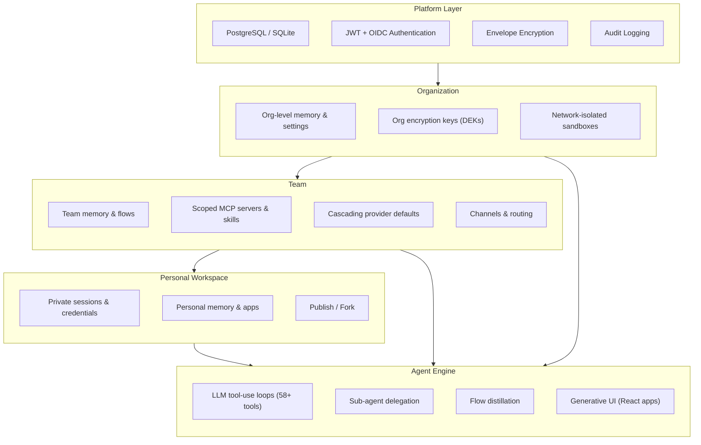

# Architecture

Astonish uses a layered architecture where each level provides isolation, configuration cascading, and scoped access. Resources flow downward as defaults; data flows upward only through explicit publishing.

## Layer Model

## Layer Descriptions

### Platform Layer

The foundation. Manages authentication, encryption key hierarchy, database connections, and system-wide audit logging. With SQLite, this layer runs locally with all platform modules active (vector search, FTS5, credential encryption). With PostgreSQL, it adds full multi-tenant isolation (database-per-org, schema-per-team).

### Organization

A tenant boundary. Each organization gets its own database, encryption keys (DEKs protected by a master KEK), network-isolated sandbox environments, and org-level memory. Organizations cannot access each other's data at any level, including at the SQL layer.

### Team

The collaboration unit. Teams share memory, flows, MCP server configurations, skills, AI provider defaults, and channel routing rules. Team-scoped resources are available to all members without individual configuration. Multiple teams exist within one organization, each with their own scope.

### Personal Workspace

Every user's private space. Sessions, credentials, apps, and personal memory live here by default. Users can publish resources to their team (flows, memory, apps) or fork team resources into their personal space for customization.

### Agent Engine

The execution core, built on Google's Agent Development Kit (ADK). The engine runs LLM-driven tool-use loops with 90+ built-in tools, delegates to sub-agents for complex tasks, distills successful sessions into reusable flows, and generates live React applications from natural language descriptions. The agent draws context from personal, team, and org memory simultaneously with intelligent weighting.

## Key Design Principles

**Cascading configuration.** Settings flow from platform to org to team to personal. Each level can override the level above. Teams get sensible defaults from day one; individuals can customize without affecting others.

**Private by default, shared by choice.** All user data is private until explicitly published. Publishing is a conscious action, not a default behavior.

**Structural isolation.** Security boundaries are enforced at the database level (separate databases, schemas, and row-level policies), not just application logic. Audit tables have UPDATE and DELETE revoked at the database level.

**Single binary.** The deployment type is determined by the configured database backend. No separate server component, no microservices — one process handles everything. SQLite for local, PostgreSQL for multi-tenant cloud deployments.
